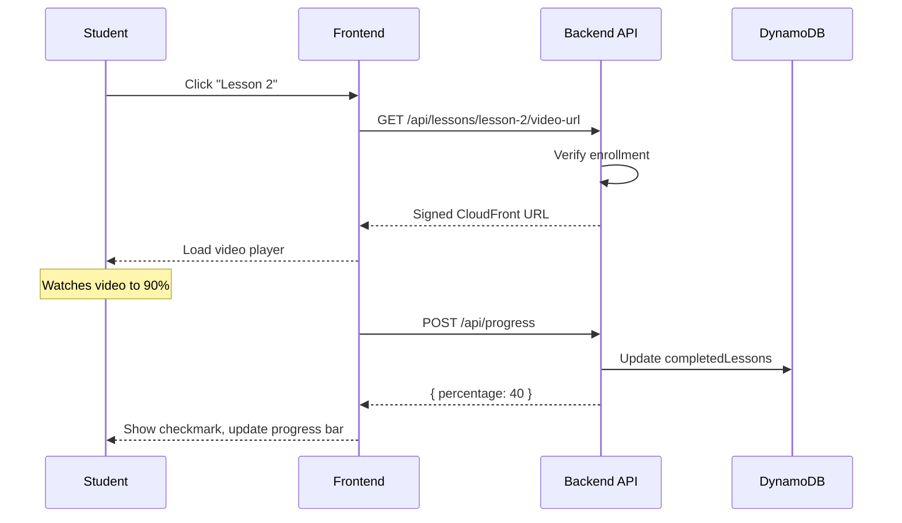
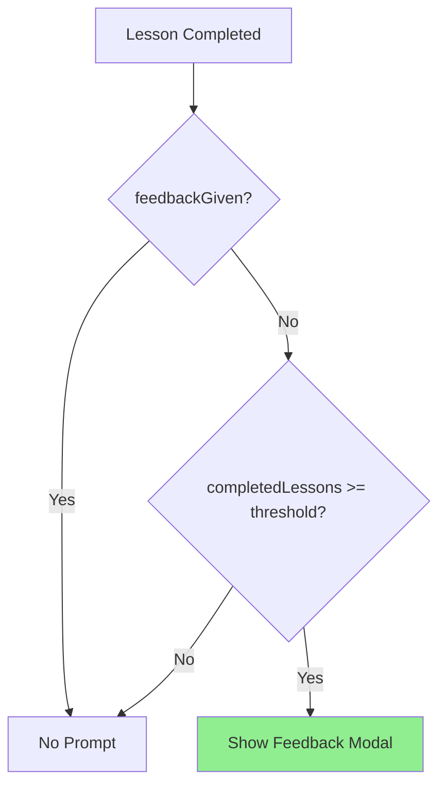

# Spec Planning

Turn a PRD into a structured Spec Plan using Spec-Driven Development. Agent-first: this skill is invoked headless by the harness dispatcher, with the feature slug as its single argument. It reads disk, does the work, commits artifacts plus a sentinel, and exits.

## Invocation Contract

**Invoked by the dispatcher as:** `claude -p "/spec-planning <feature>"`, run from inside the feature worktree (the dispatcher `cd`s into it — there is no print-mode `--cwd` flag).

**Single argument:** `<feature>` — kebab-case feature slug. All paths derive from this.

**Inputs read from disk (paths relative to cwd):**
- `prds/<feature>/prd.md` — the why, user story, definition of done, constraints, out-of-scope.
- `prds/<feature>/run-prd-test.sh` — executable test runner for this feature's PRD test. Exits 0 when the feature is done.
- Any verification artifacts under `prds/<feature>/` invoked by `run-prd-test.sh` — fixtures, LLM-judge prompts, helper test files, etc. The runner is the single contract; its internals are intentionally flexible (pure unit test, LLM-as-judge, deterministic shell checks, or any mix).
- The current codebase.

**Outputs to disk (paths relative to cwd):**
- `specs/<feature>/mainspec.md`
- `specs/<feature>/slices/*.md`
- `specs/<feature>/.planning-done` (empty sentinel)

**Completion protocol (in order):**
1. Write all mainspec + slice files.
2. `git add` those files, commit with a clear message, push.
3. `touch specs/<feature>/.planning-done`.
4. `git add` the sentinel, commit, push.

The sentinel is the **final** commit-and-push action, only after every other artifact is in place. The dispatcher uses only the sentinel to advance to spec-validate.

**Idempotency:**
- If `specs/<feature>/.planning-done` already exists, exit immediately (the previous invocation completed; the dispatcher's worktree wipe will have discarded any uncommitted intermediate state).
- If `specs/<feature>/mainspec.md` exists but the sentinel does not, treat as crash recovery: verify the existing artifacts are complete and self-consistent, fix any gaps, then write the sentinel.

**Ambiguous PRD handling:**
- If the PRD is too ambiguous to ground (contradictions, undefined terms, missing definition of done), write `prds/<feature>/clarifications-needed.md` documenting the open questions, commit it, and exit without writing the sentinel. The dispatcher will re-fire on the next tick; if the PRD has been amended, planning may now succeed.

## Spec-Driven Development & Your Role

Spec planning starts with the end in mind. You create a mainspec that defines the complete end state of a feature, then work backwards to identify logical slices—temporal chunks of intent that each focus on a clear WHAT and WHY. Each slice is a manageable piece that can be implemented independently while building toward the complete vision. Your job: read the PRD as the source of intent, research the codebase to understand what exists today, create temporal ordering of mainspecs and slices based on dependencies, and write spec outlines that paint a clear picture of WHAT needs to be built and WHY it matters. Start each slice with clear objectives and user stories to establish context and purpose. The balance: provide clear intent, constraints, and patterns from the actual codebase, but avoid being overly prescriptive about implementation details. Your output is a mainspec plus ordered slices with dependencies explicitly documented, giving implementation agents the right context to succeed.

## Guidelines

- **Ground entirely in the PRD and codebase** — Operate from `prds/<feature>/prd.md` and the codebase. Do NOT use AskUserQuestion. There is no human in the loop. If the PRD is too ambiguous to ground (contradictions, undefined terms, missing definition of done), follow the Ambiguous PRD handling protocol in the Invocation Contract above.
- **Research codebase first** - Verify what exists today before planning. Look at specs folder to see what's been done, but verify against actual code since specs may be outdated.
- **Reference the real codebase** - Ground specs in reality with actual file paths, existing patterns, and current implementations. Show what exists today as context for what should exist tomorrow.
- **Encode the PRD test as a slice success criterion** — The PRD's `run-prd-test.sh` is the definition of done. The mainspec must include a slice (typically the final one) whose Signal section names the PRD test runner (`./prds/<feature>/run-prd-test.sh`) as the validation command. When this slice completes, `./prds/<feature>/run-prd-test.sh` must exit 0. Document this requirement explicitly in the slice's Objective so the implementing agent does not miss it. The runner is intentionally opaque to spec-planning: it may invoke a unit test, an LLM-as-judge prompt, deterministic shell checks, or any mix — the slice's job is to make it pass, not to assume its internals.
- **Think temporally** - Order mainspecs (which feature comes first?) and slices (which slice enables the next?). Document dependencies clearly.
- **Right level of detail** - Clear enough for implementation agents to understand intent, but not so detailed you make up features or constrain solutions unnecessarily.
- **Document forward requirements** - In each slice, capture what future slices will need from the current work. Prevents rework and enables temporal planning.
- **Focus on WHAT not HOW** - Specs define intent and outcomes, not implementation steps. Use code snippets, exact file paths, and examples for context (see Context Engineering below), but don't write full implementation plans. Paint the picture of WHAT needs to exist and WHY, leaving HOW to the implementation phase.
- **Auto-invoke experts when triggers match** - Read the experts catalog at start of planning and invoke relevant experts to curate domain-specific context.
- **Write Signal section into every slice** - Every slice must include a Signal section to indicate how to validate the implementation. If no Signal matches, mark as None.
- **Write Slice Dependency Map into every mainspec** - Every mainspec must include a "Slice Dependency Map" section with a `Slice | Depends On | Blocks` table and a Mermaid flowchart visualizing the DAG. This is the single source of truth for slice dependencies.

## Output Structure

Specs live in `specs/<feature>/` relative to the worktree root, with this structure:

```
specs/
├── <feature-name-a>/
│   ├── mainspec.md
│   └── slices/
│       ├── 1.1-<slice-intent>.md
│       ├── 1.2-<slice-intent>.md
│       └── ...
├── <feature-b>/
│   ├── mainspec.md
│   └── slices/
│       ├── 2.1-<slice-intent>.md
│       ├── 2.2-<slice-intent>.md
│       └── ...
```

- **Slice numbering** - First digit matches mainspec order (feature 1 → 1.x, feature 2 → 2.x). Second digit is slice order within that feature.
- **Slice naming** - Use kebab-case intent after the number (e.g., `1.1-type-contracts.md`, `2.3-api-endpoints.md`).
- **Slice Dependency Map** - Every mainspec must end with this section:

  ```markdown
  ## Slice Dependency Map

  | Slice | Depends On | Blocks |
  |-------|-----------|--------|
  | X.1 — Name | — | X.2, X.3 |
  | X.2 — Name | X.1 | X.4 |

  ```mermaid
  flowchart TD
      X.1[X.1 Name] --> X.2[X.2 Name]
  ```
  ```

  Use `—` for no dependencies/blocks. Reference slice numbers (e.g., `X.1`).

## Context Engineering in Specs

Context engineering in specs is about choosing what to put in specs to eliminate ambiguity for coding agents. The biggest lever you have is what you include (or exclude) in the spec. Below are key practices to apply when writing specs.

### 1. BEFORE/AFTER with Precise File Paths

When modifying existing code, show exact file path and current state vs desired state. This eliminates ambiguity about what's changing.

**Example:**
```markdown
**File:** `backend/src/features/students/student.types.ts`

**BEFORE (Today):**
```typescript
export interface Student {
  userId: string;
  email: string;
  createdAt: string;
}
```

**AFTER (Tomorrow):**
```typescript
export interface Student {
  userId: string;
  email: string;
  createdAt: string;
  interestedInPremium?: boolean;     // New: early access signup flag
  premiumInterestDate?: string;      // New: ISO timestamp when signed up
}
```
```

### 2. Type Contracts First

Define interfaces, schemas, and data structures upfront before any implementation. This can be an entire slice focused only on types—constraining shape removes ambiguity.

**Example:**
```typescript
// Define all types before implementation
export interface LessonEntity {
  PK: string;              // "COURSE#<courseId>"
  SK: string;              // "LESSON#<lessonId>"
  lessonId: string;
  title: string;
  videoKey: string;        // S3 object key
  order: number;
}

export interface LessonResponse {
  lessonId: string;
  title: string;
  videoUrl: string;        // Signed CloudFront URL (not S3 key)
  isCompleted?: boolean;
}
```

### 3. DO/DON'T Counterexamples

Show one good example and one bad example with explanation of why the bad version fails. Negative examples prevent common mistakes.

**Example:**
```markdown
**DO ✅ - Verify enrollment before serving video URL**
```typescript
const lesson = await getLesson(lessonId);
const isEnrolled = await checkEnrollment(studentId, lesson.courseId);
if (!isEnrolled) {
  return res.status(403).json({ error: 'Not enrolled' });
}
const signedUrl = await generateSignedUrl(lesson.videoKey);
```

**DON'T ❌ - Serve video URLs without authorization**
```typescript
const lesson = await getLesson(lessonId);
const signedUrl = await generateSignedUrl(lesson.videoKey);
// Anyone with lessonId can access video - security vulnerability!
```
```

### 4. Narrative Temporal Flows with MermaidJS

Use MermaidJS diagrams to show causality across system layers. Participants should map to system boundaries (Student, Frontend, Backend API, DynamoDB, etc.).

**Sequence Diagrams** - For temporal flows showing request/response chains:



**Flowcharts** - For decision logic and component relationships:



**Spec-planning conventions:**
- Participants = system layers (not implementation classes)
- Use `style X fill:#90EE90` to highlight new components
- Focus on WHAT happens across boundaries, not HOW it's implemented internally

### 5. Forward-Looking Requirements

Document what future slices/phases will need from the current implementation. Prevents rework and captures dependencies.

**Example:**
```markdown
## Forward-Looking Requirements

### For Slice 1.3 (Progress API)
- Progress percentage calculation: `(completedLessons.length / totalLessons) * 100`
- `totalLessons` must be provided or calculated from Lesson count query

### For Slice 1.4 (Video Player Component)
- Video URL fetching: When user clicks lesson → Call `GET /api/lessons/:lessonId/video-url`
- Progress tracking trigger: When video reaches 90% → Call `POST /api/progress`
```

### 6. BEFORE/AFTER Directory Structure

When adding new components or reorganizing code, show the directory structure with inline comments explaining what's new, what's updated, and why the structure matters.

**Example:**
```markdown
**BEFORE (Today):**
```
backend/
└── email/
    └── handler.ts         # Simple Lambda handler, sends hardcoded emails
```

**AFTER (Tomorrow):**
```
backend/
└── email/
    ├── handler.ts         # Lambda handler (from Slice 4.1) - unchanged
    ├── render.ts          # NEW: Email rendering + event router
    ├── types.ts           # UPDATE: Add event and email data types
    ├── emails/
    │   ├── enrollment-email.tsx  # NEW: React Email template
    │   └── index.ts              # NEW: Export all templates
    ├── components/
    │   ├── header.tsx     # NEW: Reusable email header
    │   ├── footer.tsx     # NEW: Reusable email footer
    │   └── index.ts       # NEW: Export all components
    ├── package.json       # NEW: React Email dependencies
    ├── tsconfig.json      # NEW: TypeScript config for email workspace
    └── .react-email/      # Auto-generated by dev server (gitignored)
```

**Why this structure:**
- `emails/` folder: Templates are separate from rendering logic
- `components/` folder: Shared components for consistent branding
- `render.ts`: Central router handles all email types
- Workspace-specific package.json: Email dependencies isolated from main backend
```

## Expert & Signal Integration

Experts and Signals enhance spec planning by curating domain knowledge (Experts) and defining runtime validation (Signals).

### What Are Experts?

Experts are Agent Skills that provide domain-specific guidance during spec planning. They help curate better context by offering framework-specific patterns, security best practices, and internal library documentation, etc.

**MUST Read the experts catalog at START of planning:** `references/experts.md`

### What Are Signals?

Signals are Agent Skills that provide runtime feedback during implementation. They validate that code works as expected beyond just unit tests passing.

**MUST Read the signals catalog at START of planning:** `references/signals.md`

### How to Use Experts During Planning

1. Read `references/experts.md` at the start of spec planning
2. Match triggers - Check if the feature description matches any expert triggers
3. Auto-invoke when matched - If triggers match, invoke with `skill: "{expert-name}"`
4. Incorporate guidance - Use expert recommendations to:
   - Inform BEFORE/AFTER examples with framework-specific patterns
   - Create DO/DON'T sections based on common pitfalls
   - Define type contracts that follow framework conventions

### How to Use Signals When Writing Slices

1. Read `references/signals.md` at the start of spec planning
2. For each slice being planned:
   - Determine if the slice needs runtime validation
   - Match slice type against signal triggers
   - Write Signal section into the slice

### Signal Section Format

Every slice must include a Signal section after the Objective:

```markdown
# Slice X.Y: Name

## Objective

...

## Signal

**Signal Skill:** {signal-skill-name | None}

**Expected Behavior:**
- Specific validations for this slice
- what should succeed when correctly implemented

## BEFORE/AFTER Directory Structure
[rest of slice...]
```

---