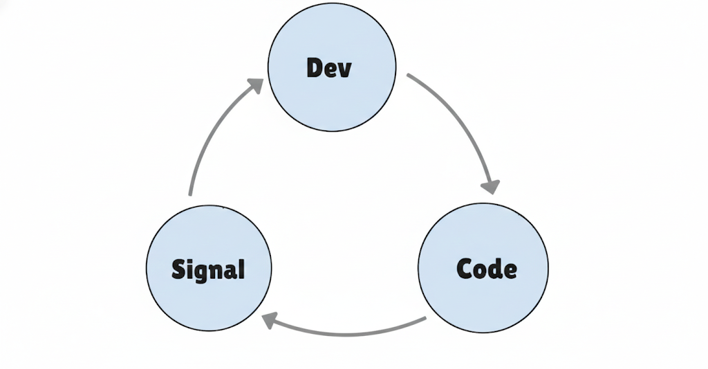
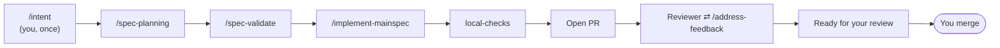
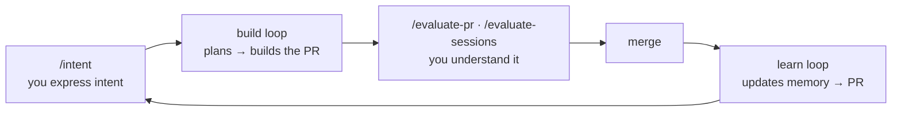

# Context Specs

**Context engineering for agent-first development.**

The biggest lever you have when building with a coding agent is what goes into
its context window — and what stays out. Context Specs is that lever, pulled at
three layers that build on each other. Pull all three and the work inverts: you
describe a feature and pin down what "done" means, then the project plans it,
implements it, verifies it, and hands you a finished pull request. What's left
for you is the judgment a model can't supply — understanding the problem,
deciding what's worth building, and telling whether what came back is right.

It ships as composable [Agent Skills](#installation). Install once, invoke via
slash commands, extend with your organization's own expertise.

> **New here? Read [the full story](./docs/README.md)** — six short chapters that
> take you from the idea to the mindset shift, in order.

---

## The idea: the right context at the right time

A coding agent is only ever as good as the context it's reasoning over — the
actual tokens in its window at the moment it decides. That window is finite, and
it degrades: older instructions lose influence, autonomously-retrieved files
crowd out relevant ones, and compaction silently drops things when it fills.

Context engineering is the discipline of getting the right context into that
window at the right time, and keeping everything else out — the agent reading
what it needs, when it needs it, from files it can navigate on its own. The three
layers below are that same idea at a widening scope: first one feature, then a
whole project that builds itself, then the way you work day to day.

→ [Chapter 1 — Context engineering](./docs/1-context-engineering.md)

---

## Layer 1 — Spec-Driven Development

*Context engineering, applied to building one feature. Usable on its own.*


You create **domain experts** from your own documentation with
[`/expert-sdd-creator`](./skills/expert-sdd-creator/SKILL.md) —
define the knowledge once, and it flows automatically through every phase:

1. **Spec Planning** ([`/spec-planning`](./skills/spec-planning/SKILL.md)) —
   research the codebase, pull in matching experts, and write the plan to disk as
   a **mainspec** plus temporally-ordered **slices**. Planning lives *outside* the
   context window, so it can't decay or compact away; slicing feeds the
   implementer only the piece it's working on.
2. **Spec Validation** ([`/spec-validate`](./skills/spec-validate/SKILL.md)) —
   3+ independent Opus reviewers plus expert review, with consensus scoring
   (3/3 = very high, 2/3 = high) turning agreement into a confidence signal.
   Impactful findings are applied in place.
3. **Implementation** ([`/implement-mainspec`](./skills/implement-mainspec/SKILL.md)) —
   slices implemented in dependency order, sequential or auto-parallelized across
   git worktrees, each gated by **Signal** (the runtime feedback loop, below).

**Composable, not hardcoded.** Multiple experts activate for one feature — a
React expert and a DynamoDB expert both contribute on a full-stack change. Add or
remove experts without touching any existing skill; organizations layer in
private experts for internal libraries the same way.



**Signal is half of what an expert is.** Where the expert curates context
*before* implementation, Signal validates behavior *during* it: run the tests,
hit the endpoint, check the build, iterate until it passes. Unit tests are the
default; experts can define richer ones.

→ [Chapter 2 — Spec-Driven Development](./docs/2-spec-driven-development.md)

---

## Layer 2 — The agent harness

*Your project runs the Layer 1 loop for you — and gets better every merge.*

The whole promise, in one sequence:

> Describe a feature to [`/intent`](./skills/intent/SKILL.md) and confirm
> it. Walk away. The project plans the feature, validates the plan, implements
> it, runs its checks, opens a pull request, answers the reviewer — and hands you
> back a PR that's ready to merge.



You can trust a machine to run this unattended because it keeps **no hidden
state**. The complete state of every feature is observable from the files on disk
and the branches in git. A small, deterministic dispatcher — **no LLM in the loop**
— reads that state each tick and shells out to a fresh `claude -p` process per
step, so no step inherits another's polluted window and crash recovery is free.
Four layers of verification (pre-commit, slice signals, `local-checks`, and a
runnable `run-prd-test.sh` definition of done) can't be talked past — and when a
step genuinely can't make progress, the harness stops and hands you a
**diagnosis-first** report rather than faking success.

**It also remembers.** When code lands on `main`, the harness updates its own
long-term memory: [`/learn`](./skills/learn/SKILL.md) reads the
merged diff and routes what's worth keeping into the Expert, the `AGENTS.md` map,
or a custom lint the agent can't ship past — so the next feature starts knowing
what the last one taught. One write path, ground truth only, behind a human
merge.

Setting all this up is itself a guided skill:
[`/harness-init`](./skills/harness-init/SKILL.md).

→ [Chapter 3 — The agent harness](./docs/3-the-agent-harness.md) ·
[Chapter 4 — Continuous improvement](./docs/4-continuous-improvement.md)

---

## Layer 3 — The human loop

*Once the machine does the typing, what's left is the part only you can do.*

The governing line is Karpathy's: *you can outsource your thinking, but you can't
outsource your understanding.* The harness took the verifiable work — syntax, API
recall, mechanics. The human loop is you, working the unverifiable: whether this
is the right thing to build, whether the abstraction is sound, whether it feels
right.

```
Understanding ──▶ Intent ──▶ [ the harness builds ] ──▶ Evaluate
   /wiki-init      /intent                              /evaluate-pr
                                                        /evaluate-sessions
```

- **Understanding** ([`/wiki-init`](./skills/wiki-init/SKILL.md)) —
  a Karpathy "LLM Wiki" that builds *your* model of the problem space, so you
  arrive at Intent with sharper questions.
- **Intent** ([`/intent`](./skills/intent/SKILL.md)) — turn that
  understanding into a PRD plus a runnable definition of done.
- **Evaluate** ([`/evaluate-pr`](./skills/evaluate-pr/SKILL.md) +
  [`/evaluate-sessions`](./skills/evaluate-sessions/SKILL.md)) —
  walk the change to build real understanding, *and* read the build trail to find
  where the project's context served the agents or failed them. The flywheel:
  *observe a trace → capture it as an eval → fix the context → it persists as a
  regression test.*

Your loop's output is the harness's input; the harness's output is your loop's
input. When you evaluate, you don't just approve work — you improve the thing
that produced it.

→ [Chapter 5 — The human loop](./docs/5-the-human-loop.md)

---

## The shift

Put the three layers together and your project stops being a codebase you type
into and becomes a **harness you tune**. The code is an output of the system; your
attention moves from syntax to context. Three things stay yours: deep
understanding of the problem space, theorizing and expressing intent, and
evaluating outcomes to improve the context so every future feature benefits.

A codebase you type into is a constant cost. A harness you tune is an
appreciating asset — each feature leaves it a little more capable of building the
next one.

→ [Chapter 6 — The mindset shift](./docs/6-the-mindset-shift.md)

---

## Getting started

**Set it up once.** [Install the skills](#installation), then run
[`/harness-init`](./skills/harness-init/SKILL.md) — a guided setup that
builds your project's custom harness and provisions its worktrees. It runs as
**two independent loops, each in its own long-lived session.** Start them:

```bash
# session 1 — the build loop (features)
/loop 5m /poll-and-dispatch

# session 2 — the memory loop (/learn), in a SEPARATE session
/loop 10m /learn-loop
```

*(Optionally run [`/wiki-init`](./skills/wiki-init/SKILL.md) first to
build your own understanding of the problem space before you write intent.)*

With both loops running, you live in a three-beat cycle: you express intent, the
harness builds, and you evaluate what comes back.



**1 · You express intent (human loop, before).** `/intent` a feature — a PRD plus
a runnable definition of done. That PRD is the harness's input.

**2 · The harness builds (two loops).**
- **The build loop** (`/loop 5m /poll-and-dispatch`) picks up your intent and runs
  the SDD chain — plan, validate, implement, verify — all the way to an open PR.
- **The memory loop** (`/loop 10m /learn-loop`) watches `main`. Every merge is a
  chance to add memory, or remove a memory a change has made stale. It raises a
  *separate* PR for those memory updates, so long-term learning never blocks the
  build loop. The two coordinate only through git.

**3 · You evaluate (human loop, after).**
- **`/evaluate-pr`** — the goal here is *understanding* the change, not reaching a
  verdict. Approving, requesting changes, or closing are byproducts of that
  understanding; the understanding itself is what lets you write sharper intent
  next time.
- **`/evaluate-sessions`** — for when the outcome was off, whether the harness got
  **STUCK** or the PR was wrong on review. This is usually a context issue: with
  the right context, the agent could have done the task. Evaluate-sessions reads every session
  that led to the PR — intent, spec-planning, spec-validate, implementation — to
  locate the **context gap**. Fixing the context matters more than fixing
  the code: the code fix repairs this one feature, while the context fix keeps the same mistake out of every future feature.

Your intent is the harness's input; the harness's PR is your evaluation's input; evaluating
improves the context that feeds the next round. That's the cycle you live in.

*(Only want the spec workflow? Layer 1 stands on its own — drive `/spec-planning`
→ `/spec-validate` → `/implement-mainspec` by hand, no harness needed.)*

---

## Installation

Install the private reviewed Tessl registry package from the project you want to equip:

```bash
tessl install cap1-context-specs/context-specs@0.1.0 --agent claude-code
```

If you want Claude Code compatibility files and a local lockfile, use the wrapper:

```bash
context-specs install
context-specs update
context-specs verify
```

The wrapper resolves `cap1-context-specs/context-specs@0.1.0` from the Tessl registry,
then mirrors the skills into `.claude/skills/`, copies the Claude subagent into
`.claude/agents/`, and writes `.context-specs/manifest.json` for drift detection.
Use `--source <path>` only while testing local changes.

---

## The skills

| Layer | Skill | Does |
|---|---|---|
| **1 · SDD** | `/expert-sdd-creator` | Create a domain expert from your docs |
| | `/spec-planning` | Idea → mainspec + temporal slices |
| | `/spec-validate` | Multi-agent consensus + expert review |
| | `/implement-slice`, `/implement-mainspec` | Implement with Signal feedback, sequential or parallel |
| **2 · Harness** | `/harness-init` | Guided setup of the local harness |
| | `/fix-local-checks` | Honest fixes for a failing pre-PR gate |
| | `/address-feedback` | Triage and answer reviewer findings |
| | `/learn` | Post-merge long-term memory update |
| **3 · Human loop** | `/wiki-init` | Stand up a Karpathy LLM-wiki (Understanding) |
| | `/intent` | Idea → PRD + runnable definition of done |
| | `/evaluate-pr` | Evaluate the change; build understanding |
| | `/evaluate-sessions` | Evaluate the build trail; capture evals |

---

## Documentation

- **[The full story](./docs/README.md)** — the six chapters, read in order.
- **[Design invariants](./docs/invariants.md)** — the properties that make the
  harness safe to leave running.

---

## License

Apache 2.0
