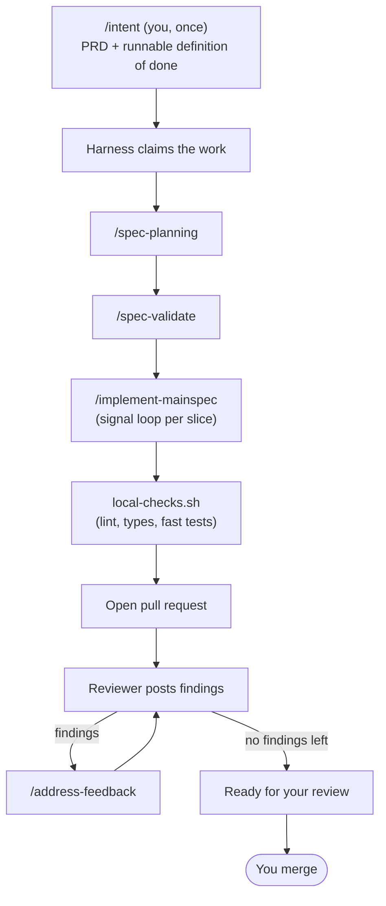

# Chapter 3 — The agent harness

*Layer 2 — the project runs the SDD loop for you.*

Here is the whole promise of this chapter in one sequence:

> You describe a feature to [`/intent`](../skills/human-loop/intent/SKILL.md) and
> confirm it. Then you walk away. The project plans the feature, validates the
> plan, implements it, runs its checks, opens a pull request, answers the
> reviewer's comments — and hands you back a PR that's ready to merge. You come
> back to finished work you never typed.

That's the harness. It takes the Layer 1 loop — `/spec-planning` →
`/spec-validate` → `/implement-mainspec` — that you used to drive by hand, and
**runs it autonomously**, end to end, while you do something else. Everything in
this chapter is in service of that one capability, and of the second question it
immediately raises: *why would you trust a machine to do this unattended?*

## The autonomous loop

A feature flows through the harness as a sequence of states. Each state is
advanced by a skill; the next skill fires when the previous one's output appears
on disk:



The only human touch in that diagram is the first box and the last. In between,
the project builds the feature itself. The reviewer/responder exchange is bounded
so it can't argue forever, and if any step genuinely can't make progress, the
harness stops and hands you the problem rather than faking success — more on both
below.

### `/intent` — the one place a human starts

The loop begins with the single human-attentive skill in the chain.
[`/intent`](../skills/human-loop/intent/SKILL.md) turns an open-ended idea into two
coupled artifacts:

- `prds/<feature>/prd.md` — the prose: **why** this exists and **what** "done"
  means;
- `prds/<feature>/run-prd-test.sh` — the executable: **how you'll know** it's
  done. It exits 0 when the feature is built.

The runner is the load-bearing idea. Prose drifts and "done" becomes an
argument; an exit code doesn't. Before `/intent` commits anything, it runs the
script against today's unbuilt code and confirms it fails **for the right
reason** — because the behavior is genuinely absent, not because of a typo or a
missing dependency. That's the empirical proof that the test actually
corresponds to the intent. (`/intent` is also where the human loop in Chapter 5
plugs in — but you can use it perfectly well on its own right now.)

Once confirmed, the PRD lands on a branch and the harness takes over.

## Why you can trust it: artifacts are the state

The reason it's safe to leave this running is almost boring, and that's the
point. **The harness keeps no hidden state.** There is no daemon holding "I'm
currently on step 3" in memory, no queue, no coordination service. The complete
state of every feature is observable from two things: the files on disk and the
branches in git.

A small bash script — the **dispatcher**
([`poll-and-dispatch.sh`](../skills/harness/harness-init/assets/poll-and-dispatch.sh))
— wakes up periodically, reads that state fresh, and decides the single next step
for each active feature. Its core is an `if/elif` chain: *planning output absent?
run planning. Present but validation absent? run validate.* The chain **is** the
state machine; the artifacts on disk **are** the state.

Three consequences fall out of that design, and together they're why the machine
is trustworthy:

- **Crash recovery is free.** Kill the dispatcher mid-step — `kill -9`, a dead
  laptop, a closed lid. The next tick re-reads disk, sees the half-finished
  state, and resumes. Nothing to clean up, because nothing was ever held in
  memory to lose.
- **Every step runs in a fresh context window.** The dispatcher doesn't *do* the
  work; it shells out to a brand-new `claude -p` process per skill. Each skill
  reads what it needs from disk, does its job, writes its output, and exits. No
  step inherits another's polluted window — the Chapter 1 problem, solved by
  construction. (This is also why the loop can run for hours without the context
  rot a single long session would accumulate.)
- **The dispatcher itself contains no LLM.** The decision of *what runs next* is
  pure, deterministic bash. The intelligence is in the skills; the routing is
  mechanical. That's what makes "what will it do next?" answerable just by
  looking at disk — no model in the loop to second-guess.

These properties have names and precise statements. When you want the rigorous
version — what holds under concurrency, what each layer guarantees, how recovery
composes — read the **[design invariants](./invariants.md)**. This chapter gives
you the intuition; that document gives you the proof.

## Verification the agent cannot talk past

Autonomy is only safe if "done" can't be faked. So the harness leans on checks
that run **regardless of what the agent decides**, fastest to slowest:

1. **Pre-commit hooks** — linters, formatters, type checks on changed files.
2. **Slice signals** — each slice's Signal section, run during implementation.
3. **`local-checks.sh`** — the cheapest gate before a PR: lint, typecheck, the
   fast unit suite, skip-detection, and any custom project lints. It proves
   **correctness, not coverage** — it blocks on real defects and merely warns on
   style.
4. **The PRD runner** — `./prds/<feature>/run-prd-test.sh` must exit 0. This is
   the definition of done, and because it can mix deterministic shell checks with
   an LLM-as-judge, "runnable" doesn't force everything into unit-test shape.

The agent doesn't get to decide whether these run — they run, and the git/CI
layer enforces them independently. Crucially, **silencing a check counts as
bypassing it**: an agent may never add a suppression directive, weaken a config,
or skip a test to get to green. A check it can't pass honestly is one it lets
fail.

## When it can't make progress: STUCK

Sometimes a feature genuinely can't get through a step — a plan is subtly wrong,
a check won't pass honestly. The harness doesn't loop forever, and it won't fake
success.
Every step has a bounded retry budget; when a step hits its cap, the dispatcher
declares the feature **STUCK**, posts a diagnostic to the PR, and halts that
feature until you step in.

What it hands you is deliberate. Not just "it failed" — a session log of every
`claude -p` invocation across the chain (so you can open any trace and see what
the agent saw), a tail of the failing output, and a **diagnosis-first
checklist**. The checklist's first item isn't "fix the code." It's *identify
which piece of context misled the agent* — a stale Expert note, a thin spec, a
PRD that left something out — and correct that first. Because if the context that
caused the failure stays wrong, the same class of failure comes back the next
time a feature touches that area.

STUCK is the harness being honest about the boundary of what it can do alone —
and routing the rest to the one place judgment lives.

## The branch namespace is the work queue

There's no separate database of "what work exists." The branches *are* the
registry:

```
prd/<author>/<feature>   ← /intent output. The waiting queue. An atomic rename
                            to feature/<f> is how the harness claims it.
feature/<feature>        ← active implementation lane.
main                     ← humans merge here. Never pushed to directly.
learn/<sha>              ← auto-generated memory update (Chapter 4).
```

Claiming a feature is a single atomic git operation — renaming `prd/<author>/<f>`
to `feature/<f>`. If two harnesses ever race for the same work, whichever pushes
the rename first wins and the other simply moves on. No lock service, no
coordination daemon; git refs are the lock. By default each developer's harness
watches only their own `prd/<my-slug>/*` queue, so your harness is your personal
assistant, not a shared teammate.

## It runs wherever you do

The skills, the artifacts, and the branch conventions are portable. The only
thing that's environment-specific is the **trigger** — what wakes the dispatcher.
That's a one-line choice, and changing it changes nothing else:

```
/loop        →   CronCreate     →   Agent SDK      →   GitHub Actions / server
single dev,      single dev,        programmatic       team-scale, runs without
visible          background         glue               anyone's laptop on
```

The recommended start is the simplest thing that exists: open a Claude Code
session and run `/loop 5m /poll-and-dispatch`. That's it — the outer loop is a
session you already have open. When a team outgrows local laptops, they move the
*trigger* to a server and keep everything else. It's an upgrade path, not a
rewrite. (Setting all of this up is itself a guided skill —
[`/harness-init`](../skills/harness/harness-init/SKILL.md) — which stands
up the dispatcher, the config, the verification gate, and the worktree
provisioning, explaining each piece as it goes.)

---

So the harness builds features on its own, and refuses to fake the ones it can't.
That alone would be worth having. But there's a second thing it does, and it's
the one that makes the project genuinely *yours* over time.

Every feature that merges teaches the project something — a new pattern, a
constraint nobody had written down, a rule worth enforcing forever. A harness
that only *built* features would relearn those lessons every time. This one
doesn't. It remembers.

→ [Chapter 4 — Continuous improvement](./4-continuous-improvement.md)
