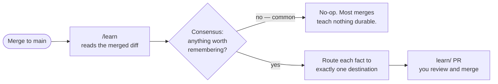

# Chapter 4 — Continuous improvement

*Layer 2 — the harness gets better every merge.*

A harness that only built features would be a fast worker with no memory. Each
feature would start from the same blank slate; the same hard-won lesson — *this
codebase puts query-param pages behind SSR*, *never import `service` from
`repo`* — would have to be rediscovered, or re-explained by you, every single
time. That's the context decay of Chapter 1, but across features instead of
within a session.

The harness closes that gap. **When code lands on `main`, the project updates its
own long-term memory.** The next feature starts knowing what the last one taught.

The skill that does this is [`/learn`](../skills/harness/learn/SKILL.md),
and a few principles make it trustworthy rather than a source of drift.

## Ground truth only — one write path

The most important rule: **memory reflects what is committed to `main`, never
what is planned.** PRDs and specs describe intent; code is reality. So `/learn`
only ever writes from a *merged diff* — never from a branch in flight, never from
a feature that might still be abandoned.

That gives the whole system a single, auditable **write path** for memory: a
human merges a feature; `/learn` observes the result; the change to memory lands
on its own `learn/<sha>` pull request that a human reviews and merges. Memory is
never auto-written by a skill mid-task, never updated speculatively. There is
exactly one door, and it opens only on ground truth.

This is also how a STUCK resolution (Chapter 3) compounds: when you correct the
misleading context on a feature branch and merge it, that correction is *in the
diff* `/learn` reads. The fix you made by hand becomes permanent project memory,
automatically.

## Two memory shapes, opposite costs

The harness keeps memory in two places, and the difference between them is the
whole discipline — it isn't an implementation detail:

- **The Expert** *(from Chapter 2)* is **lazy memory** — pulled on demand. It
  enters a context window only when a skill deliberately consults it. You pay
  tokens for it *only when it earns them*. This is the default home for real
  knowledge: architecture, patterns, how things get verified here.
- **`AGENTS.md`** is **eager memory** — loaded automatically into every agent
  that touches the folder, before anyone knows whether it's relevant. You pay
  for every line on *every* session. So the bar for putting something here is
  much higher.

Because eager memory is a standing tax and lazy memory is paid only when
consulted, the two compose as **map and territory**: `AGENTS.md` is a short table
of contents that *points into* the Expert; it never duplicates the dense
knowledge. A monolithic `AGENTS.md` rots, crowds out the task, and turns
"everything important" into "nothing important." Keep it a map; keep the density
in the Expert. (Using `AGENTS.md` — the vendor-neutral, open file every harness
reads — rather than a tool-specific one is also what keeps your project's memory
*yours*, portable across whatever agent you point at it.)

## The four destinations — where a learned fact goes

`/learn` is disciplined about *where* a remembered fact lands. Every fact worth
keeping routes to **exactly one** place:

| Destination | Use when | What it costs |
|---|---|---|
| **A lint** (`scripts/lints/*`) | The rule is mechanically checkable — pass/fail needs no judgment | Enforced on every PR forever; the error message doubles as a fix prompt |
| **Eager prose** (`AGENTS.md`) | It must be known *before* an agent would think to consult the Expert, and clears a strict five-part bar | Paid every session — the high bar |
| **Lazy prose** (an Expert shard) | It's useful when *deliberately reasoning* about an area | Paid only when consulted — the usual home |
| **Nowhere** | It's inferable from the code, taste-only, or transient | — |

Most facts go to the last two. A 0/3 consensus — "this merge teaches nothing
durable" — is a **common and correct** outcome, not a failure: vuln fixes,
refactors that don't change shape, and routine bug fixes usually change no memory
at all. The system improves by accumulating signal, not noise, and *preferring
nothing over noise* is what keeps the Expert worth reading.

## Lints — the memory an agent cannot ship past

The top row of that table deserves its own spotlight, because it's the
highest-value thing the harness can learn. A **lint** is just a short script:
glob some files, check a fact, exit non-zero with a remediation message. It beats
prose for two reasons:

1. **The error message is a prompt.** It doesn't say "violation" — it says *how
   to fix it*, feeding remediation straight into the agent's window so it
   self-corrects. A prose rule is advice the agent *might* follow; a lint is a
   rule it *cannot ship past*, plus the fix.
2. **It scales the way agents scale.** Once written, it applies to every file and
   every future PR at once.

So the most durable thing your project owns is the set of custom lints it grows
over time — layer-dependency direction, no raw SQL interpolation,
structured-logging-only, naming rules, file-size caps. Promotion is
conservative: a discovered invariant lives as prose first and is promoted to a
lint only on recurrence, and a drafted lint **must pass against the just-merged
code** before it's wired in (the inverse of `/intent`'s right-reason check — a
lint that reddens the merge it was born from is wrong).

## Consensus gates the write

Before anything changes, `/learn` spawns a few cheap reviewers that read the
merged diff against current memory and vote, per surface, on whether anything
*must* change. Only changes that clear the threshold survive. It's the same
consensus pattern `/spec-validate` uses in Chapter 2, pointed at a different
question — and it's cheap insurance against corrupting long-term memory on every
commit. Everything that does survive lands on a reviewable, revertible PR. You
stay the final gate.

## What you have at the end of Layer 2

A project that not only builds features unattended, but gets measurably easier to
build the next feature in — because every merge that taught something durable put
that lesson where the next agent will find it, at the right cost, behind a human
merge. The harness compounds.

---

Step back and notice what's happened to your job. The machine plans. It
implements. It verifies. It remembers. The typing — the part that used to be most
of the work — is gone.

That doesn't make you redundant. It makes the *remaining* part the whole job, and
the remaining part is the one a machine structurally cannot do: deciding what's
worth building, judging whether what got built is right, and improving the
context so the harness keeps getting better. That's not a side activity anymore.
It's the loop you live in.

→ [Chapter 5 — The human loop](./5-the-human-loop.md)
