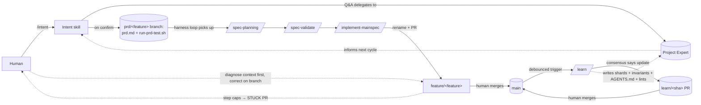
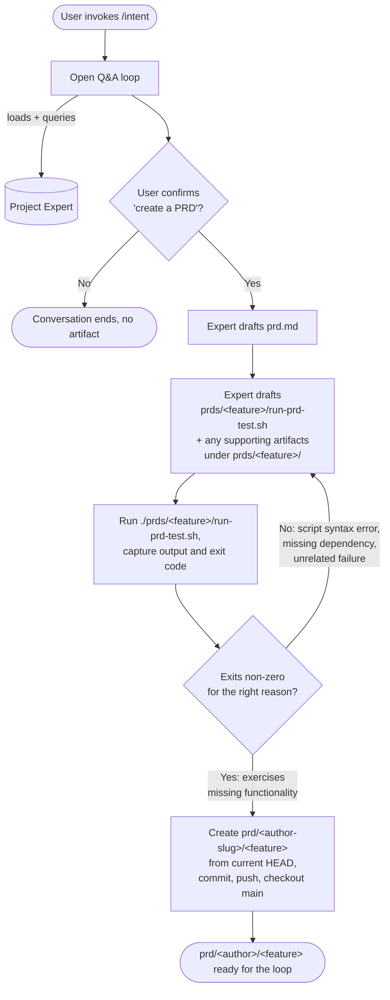
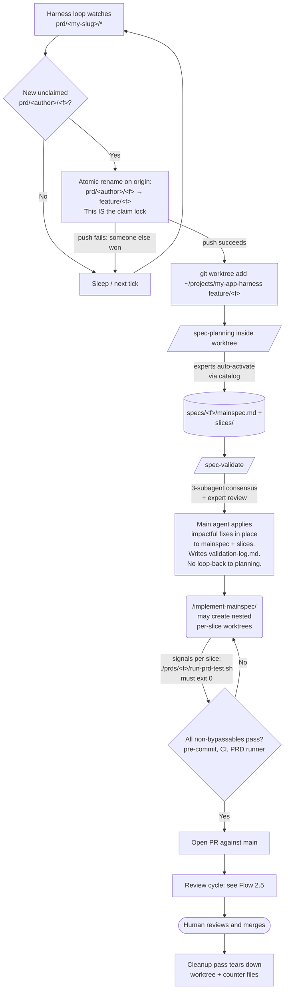
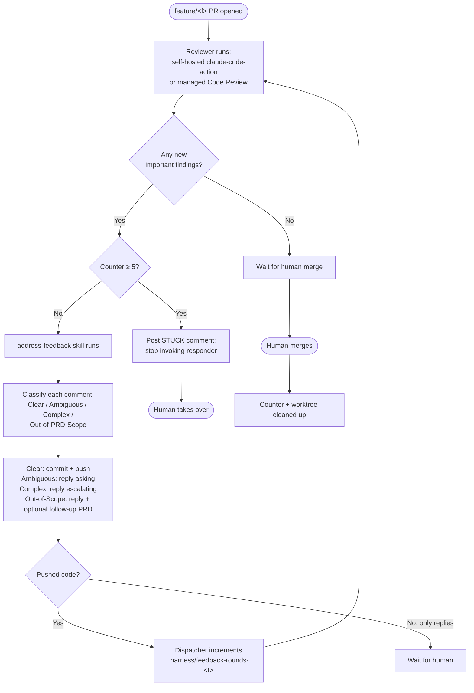
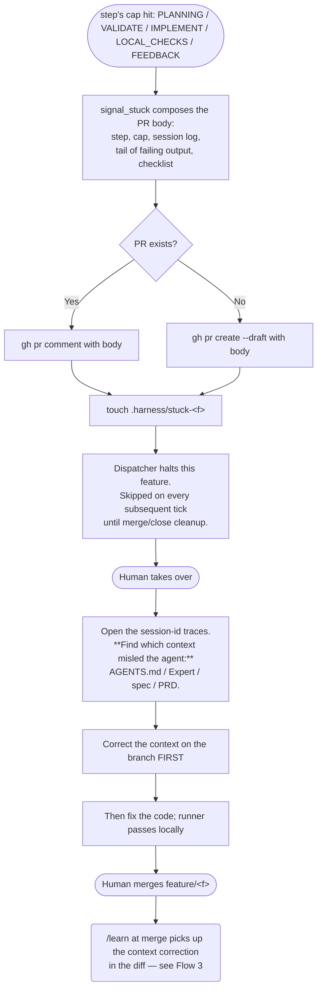
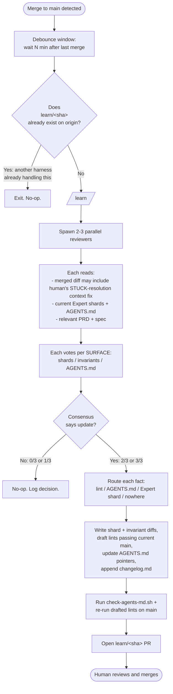
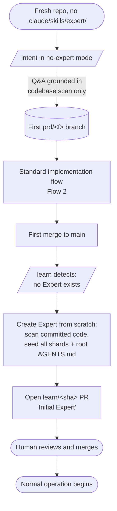

# Turning Context Specs into an Agent-First Harness Engineering Surface

A design doc for layering long-term memory, an outer loop, and self-improvement on top of [Context Specs](./context-specs/README.md) — without modifying its core skills.

---

## TL;DR

Context Specs ships as a library of agent skills for spec-driven development (`/spec-planning → /spec-validate → /implement-mainspec`). This doc shows how to compose those skills with:

- A project-scoped **Expert** (lazy, pulled on demand) plus an **AGENTS.md** map (eager, loaded as agents traverse the repo) that together are the project's long-term memory across sessions.
- A new **`/intent`** skill that coordinates open-ended human/Expert conversation into a PRD + an executable `run-prd-test.sh` (the single, framework-agnostic verification contract).
- A new **`/learn`** skill that, after every merge to main, revises the Expert (incl. discovered **invariants** and drafted **lints**) and updates the AGENTS.md map — gated by multi-agent consensus.
- A **STUCK protocol** for when a step hits its retry cap: the dispatcher posts the diagnostic to the PR (session log + diagnosis-first checklist) and halts; the human's first job is to identify which piece of context misled the agent, correct it on the branch, *then* fix the code. The merge carries the context correction into main and `/learn` picks it up.
- A **branch convention** (`prd/<feature>`) that any harness can watch as its queue.
- An **AGENTS.md** entry contract (vendor-neutral, open) that makes the design portable across harnesses.

The result is an agent-first workflow where humans steer at **three** points — confirming a PRD, merging a PR, and (when needed) unsticking a STUCK feature — and the system gets better on every merge because memory grows from ground truth alone.



---

## Why this exists

Context Specs solves the inner phases of spec-driven development well: authoring, validation, implementation. Two things it does not address on its own:

1. **Long-term memory across sessions.** Each session starts cold. The senior who curates context in spec-planning has to re-bring that context every time, or it lives only in their head.
2. **The outer loop.** Who decides to start a feature? What artifact triggers `/spec-planning`? How does the system get *better* over time, not just produce one good spec?

Those gaps are precisely what [[harness-engineering]] addresses: feedforward guides + feedback sensors + a human-steered iteration loop. This doc closes the gaps by adding two skills (`/intent`, `/learn`), a two-shape memory substrate (the project Expert + the AGENTS.md map) written from ground truth alone, a STUCK protocol that hands failed features back to the human with a diagnosis-first checklist, one branch convention, and one onboarding contract (`AGENTS.md`). Context Specs core skills are untouched.

Framing is intentional: keep Context Specs a library, layer harness engineering on top.

---

## Mental model

### Expert = project's procedural memory

Per [[agent-memory]]: *"memory defines an agent... what we call 'learning' is the agent modifying its procedural memory, represented as files on a filesystem."*

The project Expert lives at `.claude/skills/expert/` with sharded references:

```
.claude/skills/expert/
├── SKILL.md
├── references/
│   ├── architecture.md       # Decisions, layering, boundaries
│   ├── verification.md       # How features get tested in this project
│   ├── patterns.md           # Soft DO/DON'T, with examples (judgment)
│   ├── procedural.md         # "How to add a new feature here"
│   ├── core-files.md         # Key files and abstractions, with paths
│   ├── invariants.md         # HARD rules the codebase upholds (→ lints)
│   └── changelog.md          # Provenance: what /learn changed, when, why
└── scripts/
    └── run_signal.sh
```

Load-bearing property: **the Expert reflects what is committed to main**, never what is planned. PRDs and specs describe intent; code is ground truth. The Expert is the agent-readable summary of that ground truth.

Composes with framework experts. A React expert and a DynamoDB expert installed alongside the project Expert all participate in `/spec-planning` and `/spec-validate` per the existing catalog mechanism. The project Expert is one of many — just the one tied to this codebase.

### Two memory shapes, opposite loading semantics

The memory layer is two artifacts that load in *opposite* ways — and that difference is the whole design, not a detail:

- **The Expert** is **pulled on demand** — a slash-invoked / catalog-activated skill ([[progressive-disclosure]] / [[just-in-time-context]]). `/intent` and `/spec-planning` consult it deliberately; the dense `references/*.md` enter context only when relevant. You pay tokens *only when you consult*.
- **AGENTS.md is eager** — loaded automatically as an agent traverses the repo (root first, then nested files closer to the working directory extend/override it), *before* it knows whether the content is relevant. You pay tokens on *every* session that touches the folder.

The consequence: the bar for putting something in AGENTS.md is **far higher** than for the Expert, because every AGENTS.md line is a standing tax while every Expert line is paid only when it earns its keep. AGENTS.md is the vendor-neutral, open memory file ([[agents-md]]) — using it (rather than a tool-specific file) is also what keeps the project's memory portable and its own, the [[memory-lock-in|anti-lock-in]] move.

The two compose as **map → territory**: AGENTS.md is the table of contents that *points into* the Expert; it never duplicates it. A monolithic AGENTS.md rots, crowds out the task, and turns "everything important" into "nothing important" — the documented [[agents-md|"table of contents, not encyclopedia"]] failure. Keep AGENTS.md a map (≤ ~150 lines root, ≤ ~80 nested, enforced by a freshness lint); keep the density in the Expert.

### The judicial bar — four destinations

`/learn` is disciplined about *where* a remembered fact lands. Every fact worth remembering routes to **exactly one** destination — and most go to the last two rows:

| Destination | Use when | Cost |
|---|---|---|
| **A lint** (`scripts/lints/*` → `local-checks.sh`) | Mechanically checkable — pass/fail needs no judgment (layer-dependency direction, "parse at boundaries", no raw SQL interpolation, naming, file-size caps) | Enforced on every PR forever; the failure message doubles as a fix prompt ([[mechanical-invariant-enforcement]]) |
| **Eager prose** (AGENTS.md) | Clears **all five predicates**: needed before consultation, non-inferable from code, harm on violation, stable, local/global | Paid every session — strict bar |
| **Lazy prose** (an Expert shard) | Useful when *deliberately reasoning* about the area, not pre-emptively | Paid only when consulted — the default home for real knowledge |
| **Nowhere** | Inferable from the code, taste-only, or transient | — |

The test for a *lint*: if pass/fail is unambiguous, lint it; if it needs taste, it stays prose. The five-predicate test and the line caps are the [[software-3-0]] hackable seam — they live as editable prose in `.claude/skills/memory/learn/references/routing-rules.md`.

### PRD = intent + runnable definition of done

A PRD is two artifacts:

1. `prds/<feature>/prd.md` — the why, the user story, the definition of done. Permanent in the repo. This is the project's "why" history.
2. **`prds/<feature>/run-prd-test.sh`** — an executable that exits 0 when the feature is done. The harness contracts only on this script's exit code. Internals are intentionally flexible: deterministic shell checks, a unit test in a project-native framework, an LLM-as-judge `claude -p` invocation with a natural-language rubric, or any mix. Any supporting artifacts (fixtures, judge prompts, helper test files) live alongside it under `prds/<feature>/` — sandboxed from the project's own test discovery so CI doesn't go red on the PRD branch. The runner must fail *for the right reason* before the PRD is merged — exercising the missing functionality, not crashing on a typo or unrelated error.

"Done" = `./prds/<feature>/run-prd-test.sh` exits 0. One uniform contract; the PRD author picks the verification shape per feature. Borrowed shape: [[feature-list-file]] + [[end-to-end-testing-agent]] from [[long-running-agent-harness]], but per-feature rather than batched, and framework-agnostic by construction.

### Branch convention = harness trigger

```
prd/<author-slug>/<feature>  → human + /intent created. prd.md + run-prd-test.sh live here.
                               <author-slug> derives from git config user.email at
                               /intent time. The harness loop watches
                               `prd/<my-slug>/*` and picks unclaimed ones.

feature/<feature>            → renamed (atomic) from prd/<author>/<feature> on claim
                               at the start of Flow 2. Author prefix drops; git log
                               preserves attribution. Harness creates its worktree
                               on this branch.

main                         → human merges feature/* PRs.
                               Merge triggers /learn (debounced).

learn/<sha>                   → auto-generated PR carrying Expert shard + invariant
                               updates, AGENTS.md pointer changes, candidate lints,
                               and a changelog entry. Human merges.
```

No file marker needed — the branch *name* is the queue. A `prd/<author>/<f>` branch with a `prd.md` and a `run-prd-test.sh` is unambiguous.

The author-slug prefix matters because **each developer's harness watches only their own queue by default**. See the local concurrency section below.

### AGENTS.md = portable entry contract

Any harness — Claude Code locally, a server runner, a future tool — lands in the repo, reads `AGENTS.md`, and learns:

- Where the Expert lives and that it should be consulted before non-trivial work.
- Where PRDs and specs live and what they mean.
- The verification layers (pre-commit, CI, slice signals, PRD test) are non-bypassable.
- The branch lifecycle.

`AGENTS.md` is the *one document that makes this design harness-agnostic* — and deliberately the **vendor-neutral, open** memory file ([[agents-md]]) rather than a tool-specific one, so the project owns its memory and isn't locked to a single tool ([[memory-lock-in]]). Claude Code, Codex, Open SWE, Cursor, and others all read it. The Claude Code `/loop` watcher is one consumer; nothing in the design forbids others.

---

## Local concurrency & multi-developer model

The human and the harness run on the same laptop, on the same repo, at the same time. They must not fight over the working tree. This section is how.

> → Invariants 3 (worktree ↔ branch 1:1), 6 (human checkout sandboxed), and 7 (cross-node safety) in [designInvariants.md](./designInvariants.md) state the safety properties this section relies on.

### Two checkouts, one repo

```
~/projects/my-app/             ← human's checkout. Always on main. Never touched by the harness.
~/projects/my-app-harness/     ← harness's persistent worktree. Moves between feature/* branches.
.git lives in my-app/; my-app-harness/ is a `git worktree`.
```

`git worktree` is built for exactly this. The two checkouts share the underlying `.git` and stay in sync via push/pull. The human edits, runs the dev server, makes commits in their checkout; the harness does the same in its worktree. Neither sees the other's HEAD changes until they're pushed.

### `/intent` is the exception — no worktree needed

`/intent` is synchronous and human-attentive. The human is sitting there talking to it; they aren't editing other files on main in the same moment. Plain branch ops in the human's checkout are sufficient:

```bash
git checkout -b prd/<author>/<feature>      # from current HEAD (main)
# write prd.md + run-prd-test.sh + supporting artifacts, run "right reason" check, commit
git push -u origin prd/<author>/<feature>
git checkout main                            # return human to where they started
```

If the human has WIP, that's a "clean your tree first" issue, not something `/intent` abstracts over.

### Per-developer prefix is the default

Each developer's harness watches **`prd/<my-slug>/*`** where `<my-slug>` derives from their git email. So Alice's `/intent` produces `prd/alice/add-search`; Bob's harness never sees it. Four reasons:

1. **Attribution.** PR is authored by the dev whose harness ran it (their git identity), and that's also the PRD's original author. Match.
2. **Cost.** Each dev's API quota pays for their own work.
3. **Observability.** Alice knows her PRD is on her machine. No mystery about where work went.
4. **Mental model.** "My harness is my personal assistant," not "my harness is a teammate that helps the team."

The watch pattern is **one config line per harness** — that's the hackable seam:

| Mode | Pattern | Behavior |
|---|---|---|
| **Default (per-dev)** | `prd/<my-slug>/*` | Each dev runs their own harness for their own work |
| **Shared pool** | `prd/*` | All harnesses race for everything; atomic rename keeps it safe |
| **CI-only** | (developers don't run a harness) | CI watches `prd/*` and does all the work |

### Atomic rename = claim lock

Flow 2 begins with an atomic rename: `prd/<author>/<feature>` → `feature/<feature>`. This is a single git ref update on origin. If two harnesses ever race (in shared-pool mode, or if a dev runs multiple harnesses), whichever pushes the rename first wins; the loser's push fails non-fast-forward, it sees `feature/*` already exists, skips. Multi-harness safety is a property of the rename, not extra coordination.

### `/learn` idempotency

The post-merge trigger may fire on multiple machines for the same merge sha. Cheap fix: `/learn` checks `git ls-remote origin learn/<sha>` before doing work. If the PR already exists, exit. Idempotent without locks.

### Nested worktrees from `/implement-mainspec`

When the harness's outer worktree runs `/implement-mainspec` in parallel mode, that skill creates additional per-slice worktrees. Three peers under one `.git` — totally fine. Worktrees share the underlying repository regardless of nesting depth. context-specs' parallel mode already relies on this.

Three operational notes (not architectural concerns):

1. **Port conflicts.** If the human runs a dev server on port 3000 in their checkout and the harness's signal scripts spin one up too, they collide. Project-level fix: signal scripts read ports from env.
2. **Disk + rebuild cost.** Each worktree gets its own `node_modules` / `target` / etc. Big monorepos feel this; most projects don't.
3. **Cleanup hygiene.** Per-slice worktrees get cleaned up per tier by `/implement-mainspec`. The harness's outer worktree persists. Verify cleanup runs; otherwise no orphans accumulate.

### CI is the upgrade path, not a fallback

When a team outgrows local harnesses, they **transition** to a dedicated daemon/server harness. They don't run both. The local-on-laptop and server-as-CI modes are two configurations of the same skills, and you pick one for your team. The mental simplicity is the point: one place where work happens.

### Multi-developer scenarios — what to expect

> → Cross-node behavior is specified in [designInvariants.md](./designInvariants.md) § 7 (Cross-node safety) and § 3 (Local vs server table).

- **Two devs file PRDs in parallel.** Each on their own slug-prefixed branch. Each runs on their own laptop. No interaction. PRs hit GitHub independently; humans review independently.
- **Two devs file PRDs that touch the same files.** Normal git rebase territory; whichever PR merges first, the other rebases. Not specific to this design.
- **Two devs file PRDs with the same feature name.** `prd/alice/login` and `prd/bob/login`. Different branches, no collision. Coordinate via Slack like you would for any duplicate work — this is a people problem, not a tooling problem.
- **One dev's laptop is offline.** Their `prd/<slug>/*` queue sits until they come back. No automatic pickup by teammates (that would defeat the per-dev model). If you want pickup, transition to CI.

---

## Inner & Outer Loops

The harness is two loops stacked, with one piece of deterministic glue between them. Naming the layers separately is what makes the rest of this design portable, hackable, and — most importantly — easy for a single developer to start.

### The orthogonal framing

```
┌────────────────────────────────────────────────────────────┐
│  OUTER LOOP — long-lived, low-context, polls disk          │
│  Fires a tick every N minutes (or on a git event)          │
│  Invokes one thing: the dispatcher                         │
└────────────────────────┬───────────────────────────────────┘
                         │ each tick
                         ▼
┌────────────────────────────────────────────────────────────┐
│  DISPATCHER — scripts/poll-and-dispatch.sh                 │
│  Deterministic bash. No LLM.                               │
│  Reads disk → decides next skill per branch → shells out   │
└────────────────────────┬───────────────────────────────────┘
                         │ Bash: claude -p "/spec-planning ..."
                         ▼
┌────────────────────────────────────────────────────────────┐
│  INNER LOOP — one fresh `claude -p` process per skill call │
│  Reads AGENTS.md + Expert, does the skill, writes          │
│  artifacts, exits. Never sees previous invocations.        │
└────────────────────────────────────────────────────────────┘
```

Three layers, independent:

- **Outer loop** owns *triggering*: when does a tick fire? Has no opinion on what the work is.
- **Dispatcher** owns *routing*: given the artifacts on disk right now, what's the next skill to run for each active branch? Pure shell — no model in the loop.
- **Inner loop** owns *the work*: one skill, one fresh context window, runs to completion, exits.

You can swap any one layer without touching the others. Runtime choice is a config decision, not an architecture decision.

### The dispatcher: artifacts ARE the state machine

One script (`scripts/poll-and-dispatch.sh`) handles every state transition for every branch. It's deterministic bash — about 50 lines, no LLM in the dispatch path itself. The `if/elif` chain *is* the state machine; the artifacts on disk *are* the state.

> → The dispatcher is the concrete realization of the invariants enumerated in [designInvariants.md](./designInvariants.md). When the prose and the script disagree, the invariants doc is the tiebreaker.

```bash
#!/usr/bin/env bash
# Serialize against concurrent ticks on this node (cron + /loop, etc.). (Inv 5)
exec {lockfd}<"$0"; flock -n $lockfd || exit 0

set -euo pipefail

SLUG="$(git config user.email | cut -d@ -f1)"
WATCH="${WATCH_PATTERN:-prd/${SLUG}/*}"
WORKTREE_BASE="../$(basename "$PWD")-harness"
MAX_WORKTREES="${MAX_WORKTREES:-1}"
PLANNING_CAP="${PLANNING_CAP:-2}"         # /spec-planning retries before STUCK
VALIDATE_CAP="${VALIDATE_CAP:-2}"         # /spec-validate retries before STUCK
IMPLEMENT_CAP="${IMPLEMENT_CAP:-3}"       # PRD-runner retries before STUCK (the plan may be wrong)
LOCAL_CHECKS_CAP="${LOCAL_CHECKS_CAP:-2}" # local-checks two-strike (auto-fix → focused LLM fix → STUCK)
FEEDBACK_CAP="${FEEDBACK_CAP:-5}"         # reviewer feedback rounds before STUCK
mkdir -p .harness

# Project-local config overrides (MAX_WORKTREES, WATCH_PATTERN, caps, ...).
[[ -f .harness/env ]] && source .harness/env

worktree_for() { echo "${WORKTREE_BASE}-$1"; }

# Invariant 2: a feature/<f> is harness-owned iff prds/<f>/prd.md is
# committed to it. Hand-pushed feature/quickfix without a PRD is ignored.
has_prd() {
  git cat-file -e "origin/feature/${1}:prds/${1}/prd.md" 2>/dev/null
}

# Make a freshly created worktree runnable: a bare worktree has no gitignored
# files (node_modules, .env, generated code), so signals and the PRD runner would
# fail for reasons unrelated to the feature. No-op if the project ships no script.
bootstrap_worktree() {
  local wt="$1"
  if [[ -x scripts/bootstrap-worktree.sh ]]; then
    ./scripts/bootstrap-worktree.sh "$wt" || \
      echo "WARN: bootstrap-worktree.sh failed for ${wt}" >&2
  fi
}

# Wrap every claude -p call. Generates a session UUID, runs claude headless with
# --session-id so the trace at ~/.claude/projects/<encoded>/<uuid>.jsonl is
# locatable later, and appends a row to .harness/sessions-<feature>.tsv. The TSV
# is the per-feature audit trail the STUCK signal points the human into.
run_claude() {
  local step="$1" feature="$2" attempt="$3"; shift 3
  local sid; sid="$(uuidgen 2>/dev/null || cat /proc/sys/kernel/random/uuid 2>/dev/null || echo "noid-$$-$RANDOM")"
  local log=".harness/sessions-${feature}.tsv"
  [[ -s "$log" ]] || printf '#timestamp\tstep\tattempt\tsession_id\texit\tduration_s\n' > "$log"
  local t0; t0="$(date +%s)"
  # NOTE: --session-id is the documented headless flag; if your claude version
  # doesn't support it, swap for --output-format json and parse session_id out.
  claude -p --session-id "$sid" "$@"
  local exit=$?
  printf '%s\t%s\t%d\t%s\t%d\t%d\n' \
    "$(date -Iseconds 2>/dev/null || date)" "$step" "$attempt" "$sid" "$exit" "$(( $(date +%s) - t0 ))" >> "$log"
  return $exit
}

# Signal STUCK to the human via the PR. Opens a draft PR if none exists yet
# (planning/validate can STUCK before any PR is open). Body includes the step,
# the cap, the per-feature session log (failing step + upstream chain), an
# optional tail of failing output, and the diagnosis-first checklist. The PR is
# the single human-facing surface; nothing else is captured to disk for the human.
signal_stuck() {
  local feature="$1" step="$2" cap="$3" output_file="${4:-}"
  touch ".harness/stuck-${feature}"
  local branch="feature/${feature}"
  local body=".harness/stuck-body-${feature}.md"
  {
    echo "## STUCK — your turn"
    echo
    echo "**Step:** \`/${step}\` — cap reached after ${cap} attempts."
    echo
    echo "**Sessions** (failing step + upstream chain — open the trace files in"
    echo "\`~/.claude/projects/<encoded-project>/<session-id>.jsonl\` to see what"
    echo "the agent saw and concluded; for a CI/server harness, your project should"
    echo "upload these as workflow artifacts):"
    echo
    if [[ -f ".harness/sessions-${feature}.tsv" ]]; then
      echo '| Time | Step | Attempt | Session ID | Exit |'
      echo '|------|------|---------|------------|------|'
      grep -v '^#' ".harness/sessions-${feature}.tsv" 2>/dev/null | tail -n 12 | \
        awk -F'\t' '{printf "| %s | `%s` | %s | `%s` | %s |\n", $1, $2, $3, $4, $5}'
      echo
    fi
    if [[ -s "$output_file" ]]; then
      echo "**Last 30 lines of failing output:**"
      echo
      echo '```'
      tail -n 30 "$output_file"
      echo '```'
      echo
    fi
    echo "## Diagnosis-first (see SETUP.md)"
    echo
    echo "Your **first** job is not the code — it is to identify which piece of"
    echo "context (\`AGENTS.md\`, an Expert shard, a spec, or the PRD) misled the"
    echo "agent or was missing. Correct it on this branch *before* the code fix;"
    echo "the merge carries both into main and \`/learn\` picks up the context fix."
    echo
    echo "- [ ] **Context defect identified:** \`<file:line>\` — \`<one-line>\`"
    echo "- [ ] Corrected the context on this branch (AGENTS.md / Expert / spec / PRD)"
    echo "- [ ] Code fixed; \`./prds/${feature}/run-prd-test.sh\` passes locally"
    echo "- [ ] Ready to merge"
  } > "$body"
  if gh pr view "$branch" >/dev/null 2>&1; then
    gh pr comment "$branch" --body-file "$body" 2>/dev/null || true
  else
    gh pr create --base main --head "$branch" --draft \
                 --title "STUCK: ${feature} (${step})" --body-file "$body" 2>/dev/null || true
  fi
}

git fetch --quiet origin

# 1. Re-attach worktrees for in-flight feature/* that lost theirs.
in_flight=()
for feature in $(git for-each-ref --sort=committerdate \
                   --format='%(refname:lstrip=4)' \
                   refs/remotes/origin/feature/ 2>/dev/null || true); do
  has_prd "$feature" || continue
  wt="$(worktree_for "$feature")"
  if [[ ! -d "$wt" ]]; then
    git worktree add "$wt" "feature/${feature}" 2>/dev/null && bootstrap_worktree "$wt" || true
  fi
  [[ -d "$wt" ]] && in_flight+=("$feature")
done

# 2. Claim new PRDs up to remaining capacity (lazy claim).
capacity=$(( MAX_WORKTREES - ${#in_flight[@]} ))
if (( capacity > 0 )); then
  for branch in $(git for-each-ref --sort=committerdate \
                    --format='%(refname:lstrip=3)' \
                    "refs/remotes/origin/${WATCH}" 2>/dev/null || true); do
    (( capacity > 0 )) || break
    feature="${branch##*/}"
    if git push origin "origin/${branch}:refs/heads/feature/${feature}" \
                       ":refs/heads/${branch}" 2>/dev/null; then
      wt="$(worktree_for "$feature")"
      git worktree add "$wt" "feature/${feature}" 2>/dev/null && bootstrap_worktree "$wt" || true
      in_flight+=("$feature")
      capacity=$(( capacity - 1 ))
    fi
  done
fi

# 3. Advance each active feature by exactly ONE step.
for feature in ${in_flight[@]+"${in_flight[@]}"}; do
  wt="$(worktree_for "$feature")"
  [[ -d "$wt" ]] || continue
  branch="feature/${feature}"

  # STUCK guard: a cap-hit handed this feature to the human via the PR.
  # Don't keep poking it — wait for merge/close (cleanup pass clears the
  # sentinel and the worktree).
  [[ -f ".harness/stuck-${feature}" ]] && continue

  # Invariant 3 guard: worktree HEAD must match the branch we're advancing.
  current=$(git -C "$wt" rev-parse --abbrev-ref HEAD 2>/dev/null || echo "")
  [[ "$current" == "$branch" ]] || continue

  # Wipe: discard uncommitted state from any crashed skill. (Inv 1 + 6)
  ( cd "$wt" \
    && git reset --hard HEAD --quiet \
    && git clean -fd --quiet \
    && git reset --hard "origin/$branch" --quiet )

  # State machine: every step has a bounded retry; at cap, signal_stuck posts to
  # the PR (opening it as a draft if necessary) with the step, the session log,
  # an optional failing-output tail, and the diagnosis-first checklist. The
  # stuck sentinel above halts further advance until the human merges or closes.
  if   [[ ! -f "${wt}/specs/${feature}/.planning-done" ]]; then
       attempts_file=".harness/planning-attempts-${feature}"
       attempts=$(cat "${attempts_file}" 2>/dev/null || echo 0)
       if (( attempts >= PLANNING_CAP )); then
         signal_stuck "$feature" "spec-planning" "$PLANNING_CAP"
       else
         echo $((attempts + 1)) > "${attempts_file}"
         run_claude spec-planning "$feature" $((attempts + 1)) "/spec-planning ${feature}" --cwd "${wt}"
       fi

  elif [[ ! -f "${wt}/specs/${feature}/.validated" ]]; then
       attempts_file=".harness/validate-attempts-${feature}"
       attempts=$(cat "${attempts_file}" 2>/dev/null || echo 0)
       if (( attempts >= VALIDATE_CAP )); then
         signal_stuck "$feature" "spec-validate" "$VALIDATE_CAP"
       else
         echo $((attempts + 1)) > "${attempts_file}"
         run_claude spec-validate "$feature" $((attempts + 1)) "/spec-validate ${feature}" --cwd "${wt}"
       fi

  elif ! ( cd "${wt}" && "./prds/${feature}/run-prd-test.sh" ); then
       attempts_file=".harness/implement-attempts-${feature}"
       attempts=$(cat "${attempts_file}" 2>/dev/null || echo 0)
       if (( attempts >= IMPLEMENT_CAP )); then
         ( cd "${wt}" && ./prds/${feature}/run-prd-test.sh ) > ".harness/stuck-output-${feature}.log" 2>&1 || true
         signal_stuck "$feature" "implement-mainspec" "$IMPLEMENT_CAP" ".harness/stuck-output-${feature}.log"
       else
         echo $((attempts + 1)) > "${attempts_file}"
         run_claude implement-mainspec "$feature" $((attempts + 1)) "/implement-mainspec ${feature}" --cwd "${wt}"
       fi

  elif [[ -x "${wt}/scripts/local-checks.sh" ]] \
       && ! ( cd "${wt}" && ./scripts/local-checks.sh ); then
       # Optional gate: auto-fix (attempt 0) → focused LLM fix (attempt 1) → STUCK at cap.
       attempts_file=".harness/local-check-attempts-${feature}"
       attempts=$(cat "${attempts_file}" 2>/dev/null || echo 0)
       if (( attempts >= LOCAL_CHECKS_CAP )); then
         ( cd "${wt}" && ./scripts/local-checks.sh ) > ".harness/stuck-output-${feature}.log" 2>&1 || true
         signal_stuck "$feature" "local-checks" "$LOCAL_CHECKS_CAP" ".harness/stuck-output-${feature}.log"
       elif (( attempts == 0 )); then
         ( cd "${wt}" && ./scripts/local-checks.sh fix || true )
         if ! ( cd "${wt}" && git diff --quiet ); then
           ( cd "${wt}" && git commit -am "chore: auto-fix lint/format" --quiet && git push --quiet )
         fi
         echo 1 > "${attempts_file}"
       else
         run_claude fix-local-checks "$feature" $((attempts + 1)) "/fix-local-checks ${feature}" --cwd "${wt}"
         echo $((attempts + 1)) > "${attempts_file}"
       fi

  elif ! gh pr view "${branch}" >/dev/null 2>&1; then
       gh pr create --base main --head "${branch}" --fill
       rm -f ".harness/planning-attempts-${feature}" ".harness/validate-attempts-${feature}" \
             ".harness/local-check-attempts-${feature}" ".harness/implement-attempts-${feature}"

  elif gh pr view "${branch}" --json reviews \
         --jq '.reviews[] | select(.state=="CHANGES_REQUESTED" or .state=="COMMENTED")' \
         2>/dev/null | grep -q .; then
       rounds_file=".harness/feedback-rounds-${feature}"
       rounds=$(cat "${rounds_file}" 2>/dev/null || echo 0)
       if (( rounds >= FEEDBACK_CAP )); then
         # No tee'd output — the failure signal is the unresolved PR comments.
         signal_stuck "$feature" "address-feedback" "$FEEDBACK_CAP"
       else
         echo $((rounds + 1)) > "${rounds_file}"
         run_claude address-feedback "$feature" $((rounds + 1)) "/address-feedback ${feature}" --cwd "${wt}"
       fi
  fi
done

# 4. Cleanup pass: tear down per-feature worktree + state for closed/merged PRs.
for feature in $(git for-each-ref --format='%(refname:lstrip=4)' \
                   refs/remotes/origin/feature/ 2>/dev/null || true); do
  state=$(gh pr view "feature/${feature}" --json state --jq .state 2>/dev/null || echo "")
  if [[ "${state}" == "MERGED" || "${state}" == "CLOSED" ]]; then
    git worktree remove "$(worktree_for "$feature")" --force 2>/dev/null || true
    rm -f ".harness/feedback-rounds-${feature}" \
          ".harness/local-check-attempts-${feature}" \
          ".harness/implement-attempts-${feature}" \
          ".harness/planning-attempts-${feature}" \
          ".harness/validate-attempts-${feature}" \
          ".harness/stuck-${feature}" \
          ".harness/stuck-output-${feature}.log" \
          ".harness/stuck-body-${feature}.md" \
          ".harness/sessions-${feature}.tsv"
  fi
done

# 5. Post-merge memory update via /learn. Ground truth only — main is the single
#    source from which memory is written. /learn reads the merged diff (including
#    any context corrections the human committed while resolving a STUCK) and
#    routes facts to: Expert shards, invariants, AGENTS.md pointers, or drafted
#    lints. ls-remote makes it idempotent across nodes: first to push learn/<sha>
#    wins; others exit. (Inv 7)
LAST="$(cat .harness/last-main-sha 2>/dev/null || echo HEAD~50)"
CUR="$(git rev-parse origin/main)"
if [[ "${CUR}" != "${LAST}" ]] \
   && ! git ls-remote --exit-code origin "learn/${CUR}" >/dev/null 2>&1; then
  run_claude learn "_main" 1 "/learn --since ${LAST} --sha ${CUR}"
fi
echo "${CUR}" > .harness/last-main-sha

# STUCK escalation is handled inline in step 3 by signal_stuck (which opens or
# comments on the PR with the session log + checklist). The human takes over
# from there — diagnoses the context defect first, corrects it on the branch,
# fixes the code, then merges. /learn picks up the context correction at merge.
```

Seven load-bearing properties (each one is the dispatcher's concrete realization of an invariant in [designInvariants.md](./designInvariants.md)):

1. **One transition per tick per branch, max.** The `if/elif` chain fires at most one branch. Next tick, the artifact written by this tick satisfies that condition and the *next* `elif` fires. The state machine walks forward one step at a time. → Invariant 5.
2. **Artifacts are the only state.** No in-memory state, no checkpoint files describing "what step we're on." A sentinel file existing IS that phase being done. Crash recovery is free — the next tick re-derives state from disk. → Invariants 1 + 4.
3. **The working tree is wiped *and* HEAD-checked at the start of every per-feature advance.** `git reset --hard && git clean -fd` throws away anything a crashed skill left uncommitted; the HEAD guard skips any worktree whose current branch doesn't match the feature being advanced (so a manually-checked-out branch can never be silently clobbered). Wipes run on per-feature worktrees, never on the human's checkout. → Invariants 3 + 6.
4. **The dispatcher never invokes an LLM directly.** It only spawns `claude -p` subprocesses or shells out to `gh`/`git`. Each subprocess is a fresh OS process, a fresh model session, a clean context window. `[[clean-state-handoff]]` made concrete. → Invariant 5.
5. **Every gate is bounded — no infinite loops.** Three circuit breakers, all deterministic: the PRD-runner gate stops after `IMPLEMENT_CAP` attempts (the plan may be broken, not the code); `local-checks.sh` uses a two-strike retry (auto-fix, then focused LLM fix); the feedback loop stops after `FEEDBACK_CAP` rounds. Each terminal STUCK drops a `.harness/stuck-<f>` sentinel and halts that feature. Projects without `local-checks.sh` skip that gate entirely. → Invariant 8.
6. **`MAX_WORKTREES` is the single concurrency knob.** Default `1` = FIFO single-worktree; raise it for bounded parallelism. Claims are **lazy** — PRDs over remaining capacity stay in `prd/<slug>/*` as the visible waiting queue, never prematurely renamed to `feature/<f>`. In-flight work always continues regardless of cap changes (the cap throttles intake, not continuation). Pickup order is FIFO by remote branch committerdate. → Invariants 2 + 3.
7. **STUCK is the third human-steering point; memory has one write path.** A cap-hit in step 3 calls `signal_stuck`, which opens (or comments on) the PR with the session log, the failing-output tail, and the diagnosis-first checklist — then halts that feature. The human's first job is the context defect, not the code; the merge carries both fixes back. Memory is *only* written by `/learn` at step 5, post-merge, from ground truth. → Invariant 7.

Adding a new skill to the pipeline (say, `/security-review` between validate and implement) means inserting one `elif` clause. Not writing a new dispatcher. Not changing any inner skill.

### The skill contract

Every skill in the chain has a contract with the dispatcher: *what artifacts must exist on disk when I finish, so the dispatcher knows to move on?* The dispatcher reads only those artifacts. Skills are otherwise free internally — they may iterate, retry, commit intermediate state, invoke other skills, whatever they need.

**Sentinel rule.** Where a natural artifact doesn't exist (e.g., "validation finished" has no obvious file), the skill must `touch` a small sentinel file as its **final** action, only after all required artifacts exist on disk AND are committed. The dispatcher uses **only the sentinel** as the completion signal — never partial artifact presence.

| Step | Required artifacts on completion | Sentinel checked by dispatcher |
|---|---|---|
| `/intent` | `prds/<f>/prd.md`, **`prds/<f>/run-prd-test.sh`** (executable; exits 0 when feature done; internals may be deterministic checks, LLM-as-judge, a project-native test, or any mix), any helper artifacts referenced by the runner under `prds/<f>/`, pushed `prd/<author>/<f>` branch | Branch exists in `prd/<author>/*` |
| `/spec-planning` | `specs/<f>/mainspec.md` + all referenced slices in `specs/<f>/slices/*.md`, committed | `specs/<f>/.planning-done` |
| `/spec-validate` | In-place edits to `specs/<f>/mainspec.md` and `slices/*.md` for impactful 3/3 + 2/3 findings; `specs/<f>/validation-log.md` audit trail committed | `specs/<f>/.validated` |
| `/implement-mainspec` | Slice PRs merged into `feature/<f>`, all committed and pushed, PRD runner exits 0 | `./prds/<f>/run-prd-test.sh` exits 0 |
| `scripts/local-checks.sh` *(optional, project-owned)* | Lint/format/typecheck/fast-tests/skip-detection + `scripts/lints/*` pass; supports a `fix` subcommand; custom lints emit remediation-rich messages | Exit 0 (deterministic) |
| `/fix-local-checks` *(new, focused)* | Cause fixed (never silenced; no skip markers), re-verified, committed | `scripts/local-checks.sh` exits 0 |
| Final PR | `feature/<f>` PR exists against main | `gh pr view feature/<f>` succeeds (deterministic) |
| Reviewer (managed or self-hosted) *(see Flow 2.5)* | Inline comments + check run posted on PR | `gh pr view --json reviews` returns reviewer entries |
| `/address-feedback` *(new, see Flow 2.5)* | For Clear comments: code changes committed and pushed. For Ambiguous/Complex/Out-of-PRD-Scope: replies posted to threads. | Counter `.harness/feedback-rounds-<f>` incremented (deterministic); reviewer's next pass posts no new Important findings |
| STUCK escalation | Any step's cap hit (`PLANNING_CAP`, `VALIDATE_CAP`, `IMPLEMENT_CAP`, `LOCAL_CHECKS_CAP`, or `FEEDBACK_CAP`); `signal_stuck` opens or comments on the PR with the session log + diagnosis-first checklist | `.harness/stuck-<f>` sentinel; dispatcher halts that feature until merge/close |
| `/learn` *(post-merge)* | Expert shard + `invariants.md` updates, candidate lints (passing current main), AGENTS.md pointer updates, `changelog.md` entry; `learn/<sha>` branch pushed. Human-authored memory edits already in the merged diff are treated as ground truth. | Remote ref `learn/<sha>` exists |

**Idempotency.** Every skill must be safe to re-invoke on the same disk state. If a skill crashes after committing some artifacts but before writing its sentinel, the next tick wipes uncommitted state and re-invokes the same skill. The skill should produce the same end result.

**What context-specs needs to change to satisfy this contract.** Four small migrations against the existing skills (a fifth — the spec-validate sentinel and in-place fix application — is already shipped):

1. `/intent` produces `prds/<f>/prd.md` plus an executable `prds/<f>/run-prd-test.sh` (and any supporting artifacts the runner references — fixtures, judge prompts, helper test files). The runner is the single contract; the Expert picks its internal shape (deterministic checks, LLM-as-judge, project-native test, or any mix) from the same conversation that produced the PRD.
2. `/spec-planning` adds `touch specs/<f>/.planning-done` as its final commit-and-push.
3. `/implement-mainspec` runs purely headless (no `AskUserQuestion` tier gates) — replace human-pause with auto-merge of slice PRs when signals pass.
4. Branch naming alignment: today's `feat/<mainspec-name>` becomes `feature/<f>` to match the harness convention. The skill already handles "branch already exists" (it does), so this is just a rename.

`/spec-validate` is already aligned: it spawns 3 parallel Opus subagents + expert review, deduplicates and classifies findings (impactful vs. nitpick, 1/3 discarded), and the **main agent applies impactful fixes directly to the spec files in place** — no loop-back to `/spec-planning`. It writes `validation-log.md` (observability), then the `.validated` sentinel as the final commit.

Plus three new skills:

- `/fix-local-checks` — narrow post-implement polish specialist (lives at `.claude/skills/dev/fix-local-checks/`), not a replacement for `/implement-mainspec`. Re-runs `./scripts/local-checks.sh`, reads the remediation-rich failures, and **fixes the underlying cause** — it may *never silence* a check (no suppression directives, no weakened config / `tsconfig` / `local-checks.sh`, no test-gaming, and per the skip rule no test-skip markers). It re-verifies before committing and commits only honest progress; if it can't pass a check honestly it makes partial progress and lets the gate reach STUCK rather than cheat. The dispatcher owns the retry counter; the skill does one focused pass per invocation. See "What `scripts/local-checks.sh` proves" below.
- `/address-feedback` *(see Flow 2.5)* — reads unresolved reviewer comments on the current PR, classifies each into Clear / Ambiguous / Complex / Out-of-PRD-Scope, then acts: pushes commits for Clear, posts reply-only responses for the other three. Triage grounded in the PRD and the Expert. The dispatcher owns counter enforcement; the skill itself does not track rounds.
- `/learn` *(see Flow 3)* — the post-merge memory writer. Lives at `.claude/skills/memory/learn/`. Routes each remembered fact through the four destinations (lint / AGENTS.md / Expert shard / nowhere), discovers invariants, and drafts candidate lints. Consensus-gated; opens a `learn/<sha>` PR.

### The `/loop` gotcha (read once, then forget)

By default, `/loop 5m /foo` re-runs `/foo` in the **same** Claude Code session every interval. Context grows. If `/foo` does the actual work in that session, by tick 10 the session is bloated and contaminated.

The design avoids this by making `/poll-and-dispatch` do exactly one thing: call the shell script via the Bash tool. The outer session's context grows by ~one tool call + a few lines of stdout per tick. All real work runs in `claude -p` subprocesses with fresh context.

> **Rule of thumb:** *The outer loop never invokes a skill that does real work. It only invokes the dispatcher, which shells out via `claude -p` for actual work.*

Once that rule is in place, every outer-runtime choice below satisfies the fresh-inner-context property automatically.

### The recommended default: single dev, zero setup

For a single developer starting fresh, do exactly this:

1. Install Context Specs + the skills described in this doc.
2. `/intent` interactively → confirm a PRD → `prd/<you>/<feature>` is pushed.
3. `/loop 5m /poll-and-dispatch` in any open Claude Code session.

Walk away. Come back to a PR. Merge it. The `/learn` memory PR appears 5 minutes later.

Three commands. No SDK, no cron config, no GitHub Action, no Python script. The outer loop is the Claude Code session you already have open; the dispatcher is the `/poll-and-dispatch` skill, which is a one-line shim around the shell script.

Where the new skill lives:

```
.claude/skills/poll-and-dispatch/SKILL.md
─────────────────────────────────────────
---
name: poll-and-dispatch
description: One tick of the harness outer loop. Reads disk state, dispatches one skill per branch.
---

Run `./scripts/poll-and-dispatch.sh` from the repo root and report what it did.
```

That is the entire skill. The intelligence is in the script. The skill exists so `/loop` has a slash-command-shaped target.

### Outer runtime options

All produce identical results — they differ only in *when* the dispatcher fires and *where* it runs. Pick one based on operational preference.

| Outer runtime | What ticks the dispatcher | Best for |
|---|---|---|
| **`/loop 5m /poll-and-dispatch`** | A long-lived Claude Code session | Single dev, default. Visible, interruptible, conversational. |
| **`CronCreate`** | Local cron managed by Claude Code | Single dev, background — no Claude Code window needed. |
| **Plain shell `while`** | A terminal you started | Pure Unix mode — no Claude Code wrapping anywhere. |
| **Claude Agent SDK script** | Your own Python/TS orchestrator | Programmatic control, custom hooks, custom observability. |
| **GitHub Actions on `push`/`create`** | GitHub's runners | Team has outgrown local; one canonical author identity, no laptop dependency. |
| **`/schedule` (remote cron)** | Anthropic-hosted scheduler | Cloud-native, no infra to run, no laptop required. |

A rough graduation order — *not a strict ladder, just typical evolution*:

```
/loop  →  CronCreate  →  Agent SDK  →  GitHub Actions  or  /schedule
single dev,   single dev,    any team that      team that wants fully
visible       background     wants programmatic managed or server-native
                             glue
```

You can stop at any rung. Most single-developer projects never leave `/loop`. The crucial point: **the skills, the dispatcher, the artifacts, and AGENTS.md don't change** as you move along this path. Only the outer trigger changes.

### Inner runtime is fixed: always `claude -p` (or its SDK equivalent)

Where outer is a menu, inner has one canonical implementation: `claude -p "/skill ..."` as a subprocess. Process isolation gives the fresh-context property for free. The Claude Agent SDK's `query()` is the equivalent when the dispatcher is itself a Python/TS script — each query is a fresh session. There is no scenario in this design where an inner skill runs inside the outer loop's session.

### Why this works

The split mirrors three established patterns:

- **[[long-running-agent-harness]]** — Anthropic's "initializer + coding agent, state on disk" pattern. The dispatcher's `if/elif` is a state machine over PRD/spec/test artifacts, just as their harness is a state machine over a feature list.
- **[[ralph-wiggum-loop]]** — polling with fresh context per tick. Each tick reads disk, decides, dispatches, exits. The "loop" is the cadence, not a conversation.
- **[[brain-hands-decoupling]]** — outer + dispatcher are the harness (shape, dispatch); inner skills are the agents (implementation). Each layer lives where it's best at.

The whole arrangement inherits `[[clean-state-handoff]]`'s key property: state survives every reset because it's never in a context window in the first place — it's on disk by design.

### In the wild

The pattern is already shipping in several forms — this design is consolidating, not inventing:

- **Anthropic's [autonomous-coding quickstart](https://github.com/anthropics/claude-quickstarts/tree/main/autonomous-coding)** — the canonical reference. Initializer + coding agent per fresh session, state in `claude-progress.txt` + `feature_list.json` + git log.
- **Justin Young's ["Effective harnesses for long-running agents"](https://www.anthropic.com/engineering/effective-harnesses-for-long-running-agents)** — the writeup of the pattern.
- **[Chachamaru127/claude-code-harness](https://github.com/Chachamaru127/claude-code-harness)** — explicit Plan → Work → Review cycle, structurally identical to `/spec-planning → /spec-validate → /implement-mainspec`.
- **[seolcoding/nonstop-agent](https://github.com/seolcoding/nonstop-agent)** — "24/7 coding agent framework" on the same fresh-session-per-tick discipline.
- **Vinay Trivedy's [Harness as a Service](https://www.vtrivedy.com/posts/claude-code-sdk-haas-harness-as-a-service)** — names the pattern as a category.

What this design adds on top of the shared vertebra: the *artifact-driven state machine* (richer than `feature_list.json`), the *PRD-test gate* (more rigorous than "the agent self-reports done"), and the *Expert update loop* (the system learns from merges, not just produces them).

External harnesses (OpenSWE, Cursor's background agents, Devin-style runners) can also consume `prd/*` branches if pointed at them — they become a sixth row in the outer-runtime table. The skills, dispatcher, and artifacts don't care which runtime is doing the triggering.

---

## The four flows

### Flow 1 — `/intent`: open conversation → PRD + runnable definition of done

`/intent` is a **coordinator, not a knowledge holder**. All domain reasoning is delegated to the Expert. The conversation is open-ended; sometimes the user just wants to talk through an idea and walks away with no PRD. When the user confirms, `/intent` runs the full PRD creation flow.



**The "failing for the right reason" check.** This is the load-bearing step. `/intent` runs `./prds/<feature>/run-prd-test.sh`, reads the output and exit code, and asks: *does this non-zero exit exercise the gap the PRD describes?* A `command not found` on a typo'd binary doesn't count. A deterministic check failing because the route doesn't exist does. An LLM-judge returning "feature not implemented" does. Iterate the runner (and any helper files it references under `prds/<feature>/`) until the failure shape matches the gap. Then commit.

This is the step most likely to need org-specific customization — keep the prompt simple and the seam easy to extend. The principle matters more than the heuristic.

**Humans should never hand-author the runner.** Expert drafts it, human reviews and edits if needed. This keeps the verification grounded in the project's existing patterns rather than the human's instincts — and lets the Expert make the deterministic-vs-LLM-judge call based on what the project already does.

### Flow 2 — PRD → implementation → merge

The rename happens **on claim**, not on success. That makes the rename the atomic claim lock; it also lets the harness's worktree move to `feature/<f>` immediately and stay there for the whole flow.



The loop never merges. Humans merge. That is the steering input the cybernetic governor needs.

### Flow 2.5 — PR review cycle: reviewer + responder, bounded debate

Flow 2 ends with a PR open against main. Without this flow, every comment lands directly on a human. With it, an automated reviewer flags issues and a responder addresses them — with the cap enforced deterministically so the loop can't run away.



**Recommended default: Anthropic's one-way model.** The reviewer is fire-and-forget — posts findings on PR open and on every push, and does not respond to comment replies. The responder communicates back through commits, not threads. This composes cleanly with the rest of the harness, which is already an artifact-driven state machine, not a chat loop.

Five load-bearing properties:

1. **The reviewer is non-conversational.** Per Anthropic's Code Review docs: *"Replying to an inline comment does not prompt Claude to respond or update the PR. To act on a finding, fix the code and push."* The implementer signals back via the diff. Comment threads are for human↔human only — and crucially, **a human chatting in a thread does not advance the harness either: humans steer by pushing or merging, not by chatting in threads.** Only a push shrinks the reviewer's unresolved set (fix → push → auto-resolve on the next push-triggered review); a reply — from the agent *or* a human — is invisible to both the reviewer and the dispatcher.

2. **The responder triages every comment into one of four buckets.** Anthropic's auto-fix taxonomy (Clear / Ambiguous / Complex) plus our Out-of-PRD-Scope addition. The PRD's existence makes scope-rejection a first-class action — comments asking for things the PRD explicitly excluded shouldn't burn the responder's budget.

3. **Every responder invocation counts; reply-only stalls escalate.** The dispatcher increments the counter before each `/address-feedback` run regardless of bucket. Only a *push* shrinks the reviewer's unresolved set (fix → push → auto-resolve), so a PR stuck on reply-only findings can never converge on its own — marching it to STUCK is the correct escalation to a human, not a penalty. Idempotency (the skill skips threads it has already replied to, and findings a pushed commit already addresses) keeps the no-op ticks between a reply and the cap from re-posting; it re-derives that state from the PR threads and git, not from any new `.harness` file.

4. **The cap is enforced by the dispatcher, not the agent.** A sentinel file at `.harness/feedback-rounds-<f>` is incremented by deterministic bash before each `/address-feedback` invocation. When it hits 5, the dispatcher posts a STUCK comment and stops invoking the skill. No LLM in the cap-enforcement path — same `[[clean-state-handoff]]`-respecting design as the existing two-strike `local-check-attempts` block. The counter persists for the entire PR lifetime; **no resets on human pushes, no resets per round.** A human pushing mid-debate is signal that the loop wasn't going to converge anyway; giving more budget is throwing money after a sunk cost.

5. **Convergence pressure lives in `REVIEW.md`, not the round counter.** Per Anthropic's `REVIEW.md` guidance: *"after the first review, suppress new nits and post Important findings only."* This is the primary convergence mechanism — it stops the loop from arguing about commas in round 4 by changing what counts as flag-worthy as the PR matures. The counter is the safety net.

**Triage taxonomy.**

| Bucket | Action | Burns budget? | Example |
|---|---|---|---|
| **Clear** | Make the change, commit, push. Reviewer's next pass auto-resolves the thread. | Yes | "This null check is missing — add one." |
| **Ambiguous** | Reply asking for clarification; do not push code. | No | "Should this handle the empty-input case the same way as the null case?" |
| **Complex** | Reply explaining the scope, tag the human for an architectural call. | No | "This would require restructuring the auth layer — escalating." |
| **Out-of-PRD-Scope** | Reply with a "filed as follow-up" note, optionally create a `prds/<followup>/` stub. | No | "Pagination is requested, but the PRD explicitly excluded it — recommending a separate PRD." |

Bucket boundaries are judgment calls. The skill's prompt should ground itself in the PRD (`prds/<f>/prd.md`) and the Expert before classifying — the PRD is the authoritative scope; the Expert is the authoritative pattern reference.

**Reviewer choice — self-hosted (default) vs managed.** Both consume the same `REVIEW.md`; both have the same trigger surface (PR open, push, `@claude review`). Migration is one workflow file, no other changes.

| Option | Setup | Cost | Best for |
|---|---|---|---|
| **Self-hosted via `claude-code-action`** *(recommended default)* | GitHub Actions workflow on your API key | Often well under $1/PR with Haiku for first pass + Expert as the context-narrowing mechanism + prompt caching on stable parts | Most projects |
| **Anthropic managed Code Review** | Install GitHub App; configure per-repo Review Behavior | ~$15-25/PR; multi-agent parallel review with verification step | Teams that want it turnkey and have the budget |

The Expert is the cost lever — it's the curated context that lets a smaller-model reviewer skip reading the full codebase. This is where the long-term-memory work pays off.

**`REVIEW.md` starting template:**

```markdown
# Review instructions

## Re-review convergence
After the first review, suppress new Nits and post Important findings only.
Do not re-flag findings already addressed in a subsequent push — let the
auto-resolve mechanism handle them.

## What Important means here
Reserve 🔴 Important for findings that would break behavior, leak data, or
introduce a regression against the PRD's definition of done. Style and
naming are 🟡 Nit at most.

## PRD-aware
The PRD lives at `prds/<feature>/prd.md`; the runnable definition of done is
`prds/<feature>/run-prd-test.sh`. If a finding is outside the PRD's stated
scope, mark it 🟣 Pre-existing — the responder will reply with a follow-up
PRD recommendation rather than implement it.

## Cap the nits
Report at most three Nits per review. If you found more, summarize as
"plus N similar items" rather than posting them all.
```

**Heterogeneous reviewers (upgrade path, not default).** Bun's documented pattern runs CodeRabbit and Claude Code as two reviewers with different lanes — CodeRabbit for style and conventions, Claude for logic chains and downstream effects. The two don't oscillate against each other because they're flagging different classes of issue; each runs its lane to exhaustion and the loop terminates naturally. Worth considering when:

- The team already pays for CodeRabbit
- Style/convention findings matter as much as logic findings
- The Expert can articulate a clear style lane to delegate

**Don't run two Claude reviewers in the same lane** — that's redundant and oscillates. The heterogeneity is the trick. Configuration-wise: install both GitHub Apps, scope each via its own config (`REVIEW.md` for Claude restricted to logic; CodeRabbit's settings restricted to style), let them run in parallel on PR open and on push.

**Worktree lifecycle change.** Flow 2 previously implied worktree teardown immediately after PR creation. With this flow, the worktree must persist through the review cycle so the responder can push fixes. Teardown moves to PR close/merge — handled by a cleanup pass in the dispatcher (see updates below). This also resolves the worktree-cleanup gap noted in the Open Gaps section.

### Flow 2.6 — Feature STUCK → human escalation (the third steering point)

When any step in §3 hits its retry cap, the dispatcher halts that feature and
hands it to the human via the PR. **This is the third human-steering point** —
alongside confirming a PRD and merging a PR — and the design treats it as a
first-class flow with a clear contract for the human, not as a corner case.



**The context-first rule is load-bearing.** A STUCK feature almost always reduces
to one of two context conditions: a **gap** (a real codebase constraint nobody
captured — e.g., a hidden coupling between X and Y) or a **defect** (existing
memory — `AGENTS.md` / an Expert shard / a spec / the PRD — misled the agent).
The human's *first* job is to identify which one, and *correct it on the branch
before* fixing the code. Without that ordering, the same class of failure
recurs the next time a feature touches the same area.

**What the human gets in the PR body** (composed by `signal_stuck`):

- The **step** that capped (and the cap value).
- The **session log** for this feature — every `claude -p` invocation across the
  whole chain, with timestamps, session IDs, and exit codes. The human (or the
  agents they bring) opens any session's trace via
  `~/.claude/projects/<encoded>/<session-id>.jsonl` to inspect the agent's actual
  reasoning, what context it loaded, where it went wrong. For server/CI harnesses,
  the project should upload these as workflow artifacts.
- A **tail of the failing output** (`run-prd-test.sh` or `local-checks.sh`) — the
  thing that's hard to re-derive even if re-runnable. For feedback-cap STUCK, the
  PR review comments themselves are the failure signal.
- A **diagnosis-first checklist** the human ticks: context defect identified →
  context corrected on branch → code fixed → ready to merge.

**Why no automated lesson capture.** Earlier drafts had a `/capture-lesson` skill
that wrote an episodic lesson at STUCK time. We removed it: at STUCK, only the
*problem* exists — the *solution* doesn't yet — and asking the same agent-family
that just failed to diagnose its own failure risks anchoring the human on a wrong
guess. The factual evidence (sessions, output, branch state) is everything; the
human's hands-on diagnosis is the learning; the context correction lands on the
branch and rides into main with the merge, where `/learn` observes it as ground
truth. One memory write path, single source of truth, no propose-from-confusion.

**Why a `CLOSED`-but-unmerged PR is not handled specially.** Closing a PR is
ambiguous (could mean "wrong priority" rather than "wrong approach"), and the
human has already made whatever determination they wanted. The cleanup pass tears
the worktree + state down on close; nothing else is owed.

### Flow 3 — Merge to main → memory update via `/learn`

When code lands on main, `/learn` reconciles the project's long-term memory with
the new ground truth. It runs on **ground truth only** — it writes from a merged
diff, never from a branch in flight, because only committed code is real.



Consensus pattern mirrors [[multi-agent-consensus]] used in `/spec-validate`. The trade-off: a few extra LLM calls per merge in exchange for not corrupting long-term memory on every commit. Vuln fixes, refactors that don't change shape, and routine bug fixes typically produce 0/3 — no-op. Feature merges that introduce new patterns produce 2/3 or 3/3 on one or two surfaces.

Routing uses the **four destinations** (lint / AGENTS.md / Expert shard / nowhere) from the Mental Model. Invariant discovery is conservative: prose first, promote to a lint only on recurrence, and the drafted lint **must pass against the just-merged code** before inclusion (the inverse of `/intent`'s right-reason check).

**Human-authored memory edits are ground truth.** When the merged diff already touches AGENTS.md, an Expert shard, or a spec (typical when the merge is the resolution of a STUCK), those changes are treated as authoritative. The consensus pass votes on *what else* needs to follow, not on whether to apply the human's fix.

The memory update is its **own PR**. Reviewable, revertible, gated by the same human-merge step as any other change. Hackable to auto-merge if a team trusts the consensus enough.

**Idempotency note.** The pre-flight `git ls-remote origin learn/<sha>` check makes it safe for multiple harnesses to fire on the same merge — first one wins, others exit cleanly. When a team transitions to a server-side harness (the upgrade path), this check is no longer load-bearing because only one harness runs, but it costs nothing to keep.

### Flow 4 — Bootstrap (first feature, no Expert yet)



Chicken-and-egg solved by giving `/intent` a no-Expert fallback and treating initial Expert creation as the bootstrap case of `/learn` (same as `--rebuild` for recovery). The Expert never exists in an "uncommitted" state — it's born from the first merge, exactly like every subsequent update.

---

## SETUP.md

See [SETUP.md](./SETUP.md) — the one-time human onboarding template that
ships at a consumer project's root. Read-once; agents do not load it.
Covers the three-checkout model, install steps (including the single
by-hand `git worktree add`), daily flow, multi-developer modes, and the
hackable seams the team will customize over time.

---

## AGENTS.md template

Copy this into a new project's root. Edit the bracketed parts. This is the
**agent contract** — vendor-neutral and **eagerly loaded** into every agent's
context on session start, in every worktree. It's a **map, not an encyclopedia**:
keep it pointer-shaped and under ~150 lines (a freshness lint enforces this), since
everything here is paid in tokens on every invocation. Dense knowledge lives in the
Expert (pulled on demand). Setup mechanics, multi-developer coordination, and
hackable seams live in `SETUP.md`, not here. (Ships as
`harness/harness-init/assets/AGENTS.md.template`.)

```markdown
# [Project Name]

## Onboarding (read before doing anything non-trivial)

1. `.claude/skills/expert/SKILL.md` — this project's Expert. Long-term memory; consult it.
2. `prds/<f>/prd.md` — why a feature exists. `prds/<f>/run-prd-test.sh` — its runnable definition of done.
3. `specs/<f>/mainspec.md` (+ `slices/`) — the plan for a feature.
4. `designInvariants.md` — canonical invariants; tiebreaker when prose and behavior disagree.

## The Expert (consult before non-trivial work)

The `expert` skill is this project's long-term memory — pulled on demand, not always
in context. It encodes architectural decisions, how features get verified here,
patterns (DO/DON'T), procedural steps for new features, core files, and the
project's **invariants** (hard rules, some enforced by custom lints).

Read `.claude/skills/expert/references/*.md` before adding a feature, debugging
unexpected behavior, choosing where new code lives, or deciding how to verify a change.

The Expert reflects what is **committed to main**, not what is planned. Trust the
Expert for current reality; trust PRDs and specs for intended direction.

## The skill chain

Skills walk a state machine forward, one step at a time. Each reads its
predecessor's artifacts, does its work, commits, and writes a sentinel as its final
action. The next skill fires when its trigger condition is met.

| Skill | Fires when | Writes |
|---|---|---|
| `/intent` | Human initiates | `prds/<f>/{prd.md, run-prd-test.sh}` on `prd/<author>/<f>` |
| `/spec-planning` | `specs/<f>/.planning-done` absent on `feature/<f>` | mainspec + slices + `.planning-done` |
| `/spec-validate` | `.planning-done` present, `.validated` absent | in-place spec edits + `.validated` |
| `/implement-mainspec` | `.validated` present, `prds/<f>/run-prd-test.sh` exits non-zero | commits on `feature/<f>` until runner exits 0 |
| `/fix-local-checks` | `scripts/local-checks.sh` fails post-implement | patch + commit |
| `/address-feedback` | PR has unresolved reviewer findings (budget enforced externally) | commits for Clear; replies for Ambiguous/Complex/Out-of-Scope |
| `/learn` | post-merge to main, no `learn/<sha>` on origin | Expert shards + invariants + AGENTS.md pointers + candidate lints |

**Idempotency rule.** Every skill must be safe to re-invoke on the same disk
state. Commit all required artifacts *before* writing your sentinel. A crash
mid-skill leaves the next invocation a clean re-derivation from disk.

## Memory: two shapes, one write path

- **AGENTS.md (this file + nested ones) = eager memory.** A map; loaded automatically. Keep it pointer-shaped and under the cap.
- **The Expert = lazy memory.** The dense knowledge, pulled on demand.
- `/learn` (post-merge, ground truth) writes both. It is the **only** path that writes memory; it lands on a reviewable PR a human merges.
- If a feature hits **STUCK** (any step's retry cap), the dispatcher posts the diagnostic to the PR and halts. The **human's first job is the context defect**, not the code — correct the misleading `AGENTS.md` / Expert / spec / PRD on the branch, then fix the code, then merge. `/learn` observes the context correction in the merged diff.

## Branch lifecycle

    prd/<author>/<feature>   ← /intent output: prd.md + run-prd-test.sh.
                                Do not work on these directly; an atomic
                                rename to feature/<f> is the claim.
    feature/<feature>         ← active implementation lane.
    main                      ← humans merge only. Never push directly.
    learn/<sha>               ← auto-generated post-merge memory PR; humans merge.

## Non-bypassable verification

Four layers gate "done." All four must pass; none can be talked past.

1. **Pre-commit hooks** — linters, formatters, type checks (see [project config]).
2. **Slice signals** — each slice's `Signal` section runs during `/implement-slice`.
3. **CI** — full test suite, full type check, full lint (incl. custom invariant lints in `scripts/lints/`).
4. **PRD runner** — `./prds/<feature>/run-prd-test.sh` must exit 0 before merge.
   This is the definition of done.

**Silencing a check is bypassing it.** Suppression directives (`@ts-ignore`,
`eslint-disable`, `as`/`!`, …), weakened configs, and skipped tests (`.skip`,
`xfail`, …) may only be added by a human, deliberately, on the branch — never by an
agent. An agent that can't pass a check honestly lets it reach STUCK.

Anything bypassing these layers is a bug, not a feature.
```

---

## Worked example: adding `/search` to a Next.js app

Concrete walkthrough of one feature end-to-end.

### Setup

Repo `my-next-app` already has `.claude/skills/expert/` populated from prior work. Existing routes: `/`, `/posts/[id]`. Tests in `tests/integration/` using Playwright.

### Step 1 — `/intent`

User: `/intent`

`/intent` loads the Expert. Conversation:

> Intent: What would you like to add?
> User: A search page that queries posts by title.
> Intent: *(queries Expert: how do we verify new routes here?)* The Expert says we use Playwright integration tests against the running dev server with seeded fixtures. Should the search be SSR or client-side?
> User: SSR with `?q=...`.
> Intent: Make this a PRD?
> User: Yes.

`/intent` delegates to the Expert and writes:

`prds/search/prd.md`:

```markdown
# PRD: Search posts by title

## Why
Users browsing `/posts/[id]` have no way to find a post by name. The post
list on `/` is unsorted and grows unbounded.

## User story
As a reader, I can navigate to `/search?q=foo` and see posts whose title
contains "foo".

## Definition of done
`./prds/search/run-prd-test.sh` exits 0:
- `/search?q=hello` renders at least one link to a post whose title
  contains "hello" (seeded fixture).
- `/search` with empty query renders an instruction message and no
  results list.

## Out of scope
- Fuzzy matching, body search, pagination.

## Constraints
- SSR (per Expert: SSR everywhere in this project).
- No new dependencies.
```

`prds/search/run-prd-test.sh` (drafted by Expert — hybrid deterministic + LLM-judge, no skip mechanism needed because the runner lives under `prds/` and the project's test discovery doesn't reach it):

```bash
#!/usr/bin/env bash
# Definition of done for the search feature.
# Internals are this PRD's business; the harness only checks exit code.
set -euo pipefail

# --- Deterministic checks (fast, cheap, run first) ---
[[ -f app/search/page.tsx ]] || { echo "missing app/search/page.tsx"; exit 1; }
grep -q "export default" app/search/page.tsx       || { echo "no default export"; exit 1; }
npm run build --silent                              || { echo "build failed"; exit 1; }

# --- LLM-as-judge for the fuzzy bits the Expert flagged ---
# (Expert chose this shape because verifying "renders matching links"
#  via a Playwright snapshot would be brittle; the judge reads the
#  rendered page once and decides.)
exec claude -p "$(cat <<'EOF'
Start the dev server (npm run dev &), wait for http://localhost:3000.

Verify all three:
1. GET /search?q=hello renders at least one <a> whose text contains "hello"
   (a seeded post in the fixtures).
2. GET /search (no query) renders an instruction message and no results list.
3. The rendered HTML for /search?q=hello includes the matching post title
   (SSR — visible in view-source, not just after hydration).

Exit 0 if all three are true. Exit 1 with a one-line explanation per failure.
Use low temperature; don't speculate beyond what's observable.
EOF
)"
```

`/intent` runs `./prds/search/run-prd-test.sh`, sees:

```
missing app/search/page.tsx
```

That's the route file not existing — exercising the gap the PRD describes. **Failing for the right reason.** `/intent` creates `prd/alice/search` from main, commits `prd.md` + `run-prd-test.sh` (the runner itself is executable: `chmod +x` before commit), pushes, and switches Alice's checkout back to main.

### Step 2 — Harness loop picks up

Alice's Claude Code `/loop` runs every 5 minutes with `WATCH_PATTERN=prd/alice/*`. Detects `prd/alice/search`.

1. **Atomic rename on origin:** `prd/alice/search → feature/search`. This is the claim lock.
2. **Worktree:** `git worktree add ~/projects/my-app-harness feature/search`.
3. **Inside the worktree:**
   - `/spec-planning` → produces `specs/search/mainspec.md` + slices (probably 3: route scaffold, query handler, integration). React + Next.js experts auto-activate via the catalog and add framework-specific BEFORE/AFTER + DO/DON'T sections.
   - `/spec-validate` → 3 parallel Opus reviewers + expert review. Two reviewers (2/3) flag slice 2 missing an edge case for empty-query handling. The main agent classifies this as **impactful** and edits `specs/search/slices/2-query-handler.md` in place to add the edge case to the slice's Inputs and Signal sections. A 1/3 wording finding is discarded; a 3/3 cosmetic suggestion is logged as a nitpick in `validation-log.md`. Sentinel `.validated` written. **No round trip back to planning.**
   - `/implement-mainspec` → 3 slices, sequential mode (fewer than 4). Each slice's Signal validates against the now-corrected spec. After slice 3, runs `./prds/search/run-prd-test.sh`. Deterministic checks pass; LLM-judge returns exit 0. Commits.
4. PR opened on `feature/search` against `main`.

Throughout, Alice's main checkout is untouched. She's been editing a different file on main the whole time.

### Step 3 — Review cycle, then human merges

A few minutes after PR open, the self-hosted reviewer (`claude-code-action` with the project's `REVIEW.md`) posts three findings:

- 🔴 **Important** — `app/search/page.tsx` doesn't trim `?q=`; searches like `?q=%20hello` return nothing because the leading space is part of the lookup.
- 🟣 **Pre-existing** — long result lists will scroll without pagination. *(Marked Pre-existing, not Important, because the `REVIEW.md` PRD-aware rule recognizes the PRD's `## Out of scope` section explicitly excludes pagination.)*
- 🟡 **Nit** — the result mapper's loop variable is `r`; `result` would read better.

Dispatcher detects the new findings on the next tick. Counter `.harness/feedback-rounds-search` is at 0, well within the cap of 5. Increments to 1, invokes `/address-feedback`:

- Important → **Clear.** Edit the route to call `.trim()` on the query, commit `"Trim search query whitespace (1/5)"`, push.
- Pre-existing → **Out-of-PRD-Scope.** Reply in-thread: *"Pagination is excluded by the PRD's Out of scope section. Recommending a separate PRD as a follow-up — not implementing here."*
- Nit → **ignored** by the reviewer's own convergence rule (Important findings only on re-reviews); responder doesn't see it.

The reviewer's next pass observes the fix in the diff and auto-resolves the Important thread. No new findings — PR is clean.

Alice reviews the diff (one trim call, one in-thread justification), sees both match her intent, approves, merges to main.

### Step 4 — `/learn` (memory update)

5 minutes later (debounce window), the loop sees the merge. Runs `/learn`:

- 3 parallel reviewers read the merged diff + current Expert shards + the root AGENTS.md.
- 2/3 vote: `core-files.md` needs an entry for the new search route; `patterns.md` needs an SSR-with-query-params example (didn't exist before); the root AGENTS.md should gain a one-line pointer to it.
- One reviewer flags a candidate invariant — "query-param pages must be SSR" — but it's a first sighting, so it lands as prose in `invariants.md` (not yet promoted to a lint).
- 0/3 on `architecture.md`, `verification.md`, `procedural.md` — no change.

Routes each surviving fact through the four destinations, writes the diffs, and appends to `changelog.md`:

```markdown
## 2026-05-12 — feature/search merge (sha abc1234) — vote 2/3
- core-files.md: added `app/search/page.tsx`, `lib/search.ts`
- patterns.md: new section "SSR pages with query params"
- invariants.md: noted "query-param pages must be SSR" (prose; lint candidate on recurrence)
- AGENTS.md: added pointer to patterns.md#ssr-query-params
```

Runs `check-agents-md.sh` (the new pointer resolves), opens `learn/abc1234` PR. User reviews, merges.

Next time `/intent` runs for a similar feature, the memory has a precedent. The system got better.

---

## Harness portability

Skills, artifacts, and conventions above are portable. The *trigger* — what wakes the agent up — is harness-specific. Teams pick **one mode** at a time. Local first; upgrade to server when you outgrow it.

### Claude Code `/loop` (local, default)

```
/loop 5m /poll-and-run
```

Where `/poll-and-run` is a thin skill that:

1. `git fetch && git branch -r | grep '^origin/prd/<my-slug>/'` to find unclaimed PRD branches in this developer's queue.
2. `git log main --since="last tick"` to find new merges since last tick.
3. For each PRD branch, run Flow 2 (atomic rename → worktree → spec/validate/implement → PR).
4. For each new merge, idempotency-check then run Flow 3 (debounced).

Visible, interruptible, conversational. The default mode.

### `CronCreate` (local, background)

For users who want the watcher in the background without an open Claude Code session, the same `/poll-and-run` skill is schedulable via `CronCreate`. Pure UX difference — same skills, same artifacts, same outputs. Recommended once a team trusts the loop.

### GitHub Actions (server, the upgrade path)

When a team outgrows local harnesses — too many developers, want the work happening regardless of who's at their machine, want one canonical PR author identity — they transition to a dedicated server harness. **Not in parallel with local; instead of.** Developers stop running `/loop` and let the server pick up `prd/*` (no author prefix needed at that point since one harness handles all).

```yaml
# .github/workflows/agent-harness.yml
on:
  create:
    branches: ['prd/**']
  push:
    branches: [main]

jobs:
  agent-runs:
    runs-on: ubuntu-latest
    steps:
      - uses: actions/checkout@v4
      - name: Run agent
        run: |
          if [[ $GITHUB_REF == refs/heads/prd/* ]]; then
            claude-agent run /poll-and-run --branch $GITHUB_REF
          elif [[ $GITHUB_REF == refs/heads/main ]]; then
            claude-agent run /learn --since $GITHUB_SHA
          fi
```

Event-based instead of poll-based. Same skills, same outcome.

### What a new harness must implement

Any harness layered on this design owes the same three things:

1. **Trigger on PRD branch creation matching the configured watch pattern** → run Flow 2.
2. **Trigger on merge to `main`** → debounced + idempotency check, run Flow 3.
3. **Honor AGENTS.md** — load Expert at session start, respect verification non-bypassables.

Everything else is implementation detail.

---

## Hackable seams (the Software 3.0 framing)

Per [[software-3-0]]: the program *is* the prompt. Every customization point below is an English markdown file the team owns.

| Seam                          | File                                                       | What it controls                                              |
|-------------------------------|------------------------------------------------------------|---------------------------------------------------------------|
| Intent Q&A style              | `.claude/skills/intent/SKILL.md`                           | How open-ended; when to suggest "create a PRD"                |
| Failing-test heuristic        | `.claude/skills/intent/SKILL.md` (verification section)    | What counts as "failing for the right reason"                 |
| Expert shard taxonomy         | `.claude/skills/memory/learn/references/expert-shards.md`  | What categories the Expert is sharded into                    |
| Memory routing & the bar      | `.claude/skills/memory/learn/references/routing-rules.md`  | The four destinations, five-predicate test, AGENTS.md caps    |
| AGENTS.md discipline          | `.claude/skills/memory/learn/references/agents-md-guidance.md` | Map-not-manual; which folders earn a nested file          |
| Invariant → lint promotion    | `.claude/skills/memory/learn/references/invariant-discovery.md` | When prose becomes a lint; overfitting guard             |
| Update consensus threshold    | `.claude/skills/memory/learn/references/consensus.md`      | 2/3 vs 3/3 to trigger a write                                 |
| STUCK caps                    | `.harness/env` (`PLANNING_CAP`, `VALIDATE_CAP`, `IMPLEMENT_CAP`, `LOCAL_CHECKS_CAP`, `FEEDBACK_CAP`) | Retries before a step declares STUCK         |
| Poll interval / debounce      | Loop config (or `.github/workflows/*.yml`)                 | How often the watcher fires                                   |
| Watch pattern                 | Loop config (`WATCH_PATTERN`)                              | `prd/<my-slug>/*` (per-dev, default) vs `prd/*` (shared pool) |
| Auto-merge toggle             | GH Actions workflow (or absent)                            | Whether `learn` PRs auto-merge or wait for a human            |
| Linter selection              | Project's existing config                                  | Which deterministic checks run pre-commit and in CI           |
| Branch convention             | AGENTS.md "Branch lifecycle" section                       | If a team prefers `intent/<f>` over `prd/<f>` — change prompts|

The library ships defaults. Orgs change the markdown. Phases and trajectory are the model; details inside each phase belong to the team running it.

---

## Non-bypassable verification

Inspired by Stripe's "minions" pre-push hooks ([[harness-engineering]]) and the [[shift-feedback-left]] principle: **deterministic checks run regardless of what the agent decides**. The agent can't talk its way past them.

Four layers, fastest to slowest:

1. **Pre-commit hooks** (seconds): linters, formatters, type checker on changed files. Configured via the project's existing tooling (`husky`, `pre-commit`, `lefthook`).
2. **Slice signals** (per-slice): each slice's `Signal` section. Runs during `/implement-slice`. Custom signals come from installed experts.
3. **CI** (minutes): full test suite, full type check, full lint. GitHub Actions or equivalent.
4. **PRD runner → must exit 0** (gates feature merge): the load-bearing one. If `./prds/<feature>/run-prd-test.sh` returns non-zero, the feature isn't done. This is what makes "definition of done" a runnable artifact, not prose — and because the runner can mix deterministic checks with LLM-as-judge invocations, "runnable" doesn't constrain the verification to unit-test shape.

The loop doesn't decide whether these run — they run. The implement skills invoke them as signal validation, *and* the git/CI layer enforces them anyway. Two belts, one pair of pants. Linters are a project property; the harness consumes them, it doesn't own them.

### What `scripts/local-checks.sh` proves — correctness, not coverage

`local-checks.sh` is the deterministic gate between `/implement-mainspec` and the
PR — the cheapest layer to catch correctness issues, left of the reviewer ($/round)
and CI. It proves **structural correctness and test integrity**, not coverage. The
project owns the script; `harness-init` Step 5 generates it from a repo scan (see
`harness-init/references/local-checks-design.md`). Design rules:

- **Block** on correctness/structural: lint errors, typecheck, the **fast** unit
  suite (the shifted-left copy of CI's run — its unique value is catching
  *cross-slice* regressions slice signals miss), **skip-detection**, and the custom
  lints in `scripts/lints/`. **Warn** on legibility/observability (grep-ability, log
  shape) — real but not present-tense bugs. **Mutation testing is a sensor, not a
  gate here** — too slow for the hot path; run it async/nightly if at all.
- **`exit 0` is a proxy, not a proof.** A check can be turned green by *silencing*
  it — a suppression directive (`@ts-ignore`, `eslint-disable`, `as`/`!`, …), a
  weakened config, or a skipped/deleted test. `/fix-local-checks` is prompt-constrained
  against this, and the reviewer + human merge are the backstops (the reviewer's
  `REVIEW.md` flags a silenced check as Important). We deliberately **do not** ship a
  dedicated anti-cheat lint; the residual risk — a silenced check riding into main
  where `/learn` would learn it as ground truth — is accepted with those mitigations.
- **The skip rule.** An agent may never add a test-skip marker; the harness can't
  tell a legitimate skip from a dodge, so skip-detection blocks all agent-added
  skips. A legitimate skip is the **human's** call at STUCK — they add it on the
  branch, and `/learn` reads it in the merged diff as a deliberate, blessed decision
  (Flow 3: human-authored memory edits are ground truth). No flaky-allowlist — it's
  just another silencing surface.
- **Snapshot lint discovery.** At `harness-init`, the generator may *propose* custom
  correctness lints from the codebase as-is — observed existing invariants and
  surface-scoped best practice — behind five guards (must-pass-current-main is the
  discriminator; no auto-grandfathering; block only correctness/structural;
  scope-to-surface; propose-not-apply). This is *snapshot* discovery, distinct from
  `/learn`'s *stream* (per-merge) discovery. It resolves the greenfield-linter open
  gap below.
- **Dependency on a runnable worktree.** Because the gate runs typecheck and tests,
  the harness worktree must be fully provisioned (`bootstrap-worktree.sh`) or these
  legs fail for the wrong reason → false STUCK. A correct gate depends on a correct
  bootstrap.

### Custom invariant lints — memory that the agent can't ship past

The most durable verification a project owns is the set of **custom lints** `/learn`
grows over time under `scripts/lints/` (run by `local-checks.sh` and CI). A custom
lint is just a short script — glob files, inspect contents (grep or a parser),
assert a structural fact, exit non-zero with a remediation message. It is the
highest-value destination in the four-way routing for two reasons ([[mechanical-invariant-enforcement]]):

1. **The error message is a prompt.** It doesn't just say "violation" — it says how
   to fix it, feeding remediation straight into the agent's context so it
   self-corrects. A prose rule in AGENTS.md is advice the agent *might* follow; a
   lint is a rule it *cannot ship past*, plus the fix.
2. **It scales the way agents scale** — once encoded, it applies to every file and
   every future PR at once.

Examples a project might accrue: layer-dependency direction ("`repo/` may not import
from `service/`"), no raw SQL interpolation, structured-logging-only, naming/format,
file-size caps. The freshness lint for the memory files themselves (`check-agents-md.sh`)
is a lint of this kind, shipped with `/learn`. The rule for *promoting* a discovered
invariant to a lint is in Flow 3: prose first, lint on recurrence, and the drafted
lint must pass against current main before it's wired in.

---

## Open gaps & follow-ups

Items noticed while drafting that we deferred or didn't fully resolve:

- **Linter recommendations for greenfield projects — resolved.** `harness-init` Step 5 now does *snapshot lint discovery*: it proposes custom correctness lints from the codebase as-is (observed invariants + surface-scoped best practice), behind five guards, propose-not-apply (see `harness-init/references/local-checks-design.md`). Flips the old default from hands-off to propose-strictly-filtered ([[harnessability]]'s cheapest uplift). `/learn` continues the *stream* (per-merge) version. The strict correctness filter + must-pass-current-main keep this from becoming volume.
- **Debounce window tuning.** 5 minutes is a reasonable starting point. Some projects merge hourly; some merge several times per minute. Make it a config knob, not a constant.
- **Expert drift detection.** If `/learn` keeps returning 0/3 for many merges, is the Expert too coarse to capture changes, or is the project stable? Worth an observability hook (`consensus.md` flags this).
- **Observability.** Where do we surface (a) PRD success rate, (b) average rounds through spec-planning/validate, (c) `/learn` PR approval rate, (d) which lessons came from which failures (attribution trace)? A `harness-stats` skill reading git history + skill logs is the obvious next step. Aligns with the SDLC eval roadmap in the Context Specs README.
- **Expert recovery.** If the Expert is corrupted (bad merge, accidental delete), `/learn --rebuild` regenerates from main — same code path as bootstrap. Document explicitly so users know the recovery story.
- **PRD and spec lifecycle after merge.** PRDs stay permanent (the "why" history). Specs stay too. Neither is cleaned up. Storage cost is negligible; archeological value compounds.
- **Non-feature work.** Vuln fixes, dependency bumps, refactors — these usually skip `/intent` and `/spec-planning` entirely. They land via normal PRs; `/learn` still runs post-merge. Most produce 0/3 consensus and no-op. Document this carve-out.
- **Context-first cultural lift.** The STUCK protocol asks the human to identify the *context defect* before fixing the code. The doc + SETUP.md + harness-init walkthrough teach the habit; the PR-body checklist nudges it. Adherence is on the human — if they routinely skip context-first and just patch the code, the same class of failure recurs. A future enforcement could be a PR template that requires naming the corrected `<file:line>` before merge, but it's a cultural lift first.
- **Trace portability for non-local harness modes.** Session traces (the `.jsonl` files the STUCK PR body links to) live on the node that ran the harness. For local `/loop`, that's the dev's laptop — perfect. For server / CI harnesses, the traces sit on the runner's filesystem and need to be uploaded as workflow artifacts for the human to fetch. The harness exposes the session IDs in the PR; wiring artifact upload is project-specific (one CI step) and not built in.
- **Eval-from-STUCK as a downstream possibility.** The captured artifacts (session IDs, tee'd output, branch SHA pinning the in-scope context) are sufficient to construct a faithful eval: replay the failure against the *corrected* context and verify the agent no longer makes the same wrong move. The design doesn't ship eval infrastructure, but the substrate is in place — projects that want it can build it from what the STUCK PR exposes.
- **No automated learning from never-merged failures (by design).** If a STUCK feature is abandoned (PR closed without merge), the project learns nothing durable from it. We chose this trade explicitly: the *resolution* (which is the real signal) only exists when the human merges a fix, so capture-at-pain without resolution either (a) writes confused lessons that anchor future agents, or (b) requires correlation machinery (rolling lesson PRs, slug tracking) that adds complexity without much payoff. Worth revisiting if a project sees enough abandons that the pattern itself becomes the lesson.
- **Port allocation for signal validation.** When the harness's worktree runs signals that spin up dev servers, ports may collide with the human's local dev server. The pattern (signals read ports from env) is straightforward but worth a project-level convention up front.
- **Reviewer failure or timeout.** When the reviewer (self-hosted Action or managed Code Review) errors out or hits its time limit, no findings are posted. The dispatcher's current `gh pr view --json reviews` check can't distinguish "no findings because the PR is clean" from "no findings because the reviewer crashed" — both look like absence-of-comments. Worth: parse the `Claude Code Review` check-run conclusion (managed service uses titles like "Code review encountered an error" and "Code review timed out"; self-hosted Actions surface the equivalent via job exit code). Treat errored as "do not advance — retry once, then post a NEEDS-REVIEWER comment" rather than "ready to merge." Cheap fix; just not in the v1 dispatcher.

- **Cost cap alongside the round cap.** The default cap is 5 rounds, but a single round on a large PR can cost more than 5 rounds on a small one. For projects on the managed service ($15-25/round), 5 rounds is potentially $125. A complementary cost cap — `.harness/feedback-cost-${feature}` accumulating per-round cost from the API response — would let the dispatcher stop on EITHER condition. Skipped in v1 because the recommended self-hosted default with Haiku + Expert-as-context + prompt caching makes round-count the dominant constraint; worth adding when teams scale up to managed-service usage. Owner: project, not the harness — the billing surface varies by reviewer choice.
- **Context Specs skill migration to satisfy the dispatcher contract.** Five tracked changes against the existing skills (see "The skill contract" subsection): (1) `/intent` produces `prds/<f>/run-prd-test.sh`; (2) `/spec-planning` writes `specs/<f>/.planning-done` sentinel; (3) `/spec-validate` writes `specs/<f>/.validated` sentinel; (4) `/implement-mainspec` runs purely headless (no `AskUserQuestion` tier gates — replace with auto-merge on signal pass); (5) align branch naming from `feat/` to `feature/`. Plus three new skills: `/fix-local-checks` (built — `.claude/skills/dev/fix-local-checks/`), `/learn` (built — `.claude/skills/memory/learn/`), and `/address-feedback` (Flow 2.5 — not yet built). Owner: Rico.
- **Per-feature worktrees as a scaling escape hatch.** The default single-worktree-per-harness serializes feature work. Most single-developer projects don't need more, but a project with 3+ concurrent features can switch to `WORKTREE="../<repo>-harness-<feature>"` for true parallel inner work. Trade: more disk, more `node_modules`, but better wall-clock. Worth documenting as a one-config-line knob, not a default.
- **Second-order effects of `/spec-validate` being one-shot (no loop-back to planning).** The dispatcher's state machine walks forward only; `/spec-validate` patches what it can in place and exits. This is correct and intended, but shifts pressure in four places worth being explicit about:
  1. **Spec-planning quality bar rises.** No escape valve exists to redesign a fundamentally wrong plan — validate can only edit, not regenerate. Prompt quality and expert participation in `/spec-planning` matter more than they would in a system where validate could reject.
  2. **PRD-runner becomes the only "is this plan correct?" check left.** Previously a planning↔validation oscillation could have caught a deep plan defect before any code was written. Now a deep defect surfaces at `./prds/<f>/run-prd-test.sh` exit code after `/implement-mainspec` has already burned compute. Recovery cost is real — but offset by the fact that consensus-applied patches catch most of what oscillation would have caught.
  3. **Stuck-state detection is now load-bearing for every step, not just validation.** If any step keeps failing — `/spec-planning`, `/spec-validate`, `/implement-mainspec`, `local-checks`, or the feedback loop — the dispatcher would re-invoke forever. **Resolved:** every step has a bounded-retry breaker (`PLANNING_CAP`, `VALIDATE_CAP`, `IMPLEMENT_CAP`, `LOCAL_CHECKS_CAP`, `FEEDBACK_CAP`). At cap, `signal_stuck` posts the diagnostic to the PR (opening a draft if needed) with the session log + the diagnosis-first checklist, drops a `stuck-<f>` sentinel, and halts. The human takes over with context-first as the rule.
  4. **Crash recovery semantics for spec-validate.** Because the skill mutates spec files in place across multiple commits (spec edits, then sentinel), a crash mid-write can leave the worktree with partial edits. The dispatcher's `git reset --hard origin/<branch>` wipe at the top of each tick discards any uncommitted partial edits, so the next tick re-runs `/spec-validate` cleanly from the post-planning state. This is the intended safety net — but it means `/spec-validate` is genuinely non-deterministic across re-runs (different consensus outcomes possible), and projects that want reproducibility in validation should pin the model + seeds inside the skill.

---

## Related

Wiki concepts this design rests on:

- [[harness-engineering]] — the parent practice; this doc is one instantiation
- [[agent-harness]] — the harness layer overall
- [[agent-memory]] — why the Expert is procedural memory, not a database
- [[long-running-agent-harness]] — Anthropic's analogue (initializer + coding agent)
- [[autonomous-feature-delivery]] — OpenAI Codex's analogue (single-prompt end-to-end)
- [[self-verification-loop]] — what the PRD runner forces from the outside
- [[feature-list-file]] — sibling artifact at batch scale
- [[end-to-end-testing-agent]] — what "done" looks like in practice
- [[durable-agent-substrate]] — Expert + AGENTS.md as the long-lived asset
- [[agents-md]] — the vendor-neutral eager memory file; "table of contents, not encyclopedia"
- [[memory-lock-in]] — why an open, self-owned memory substrate matters; the anti-lock-in case
- [[progressive-disclosure]] / [[just-in-time-context]] — why the Expert is lazy and AGENTS.md is the map
- [[mechanical-invariant-enforcement]] — custom lints; the error-message-as-prompt; invariants over implementations
- [[repository-as-system-of-record]] — the in-repo knowledge base AGENTS.md points into
- [[entropy-garbage-collection]] — the steering loop in `/learn`
- [[multi-agent-consensus]] — pattern reused for `/learn` voting
- [[software-3-0]] — why every seam is a markdown prompt
- [[harnessability]] — what makes this design easier or harder to adopt in a given codebase
- [[ralph-wiggum-loop]] — the polling pattern the harness loop instantiates
- [[shift-feedback-left]] — why pre-commit hooks belong before CI

Context Specs canonical references:

- [context-specs/README.md](./context-specs/README.md)
- [context-specs/best-practices.md](./context-specs/best-practices.md)
- `context-specs/.claude/skills/specs/spec-planning/SKILL.md`
- `context-specs/.claude/skills/specs/spec-validate/SKILL.md`
- `context-specs/.claude/skills/dev/implement-mainspec/SKILL.md`
- `context-specs/.claude/skills/memory/learn/SKILL.md`
